**ThunderID OAuth2 & OIDC — Authentication**

Threat Model

**Version: v1**  
**Date:** 2026-06-17  
**Email: security@wso2.com**

# **Table of Contents**

[**Revision History**](#revision-history)

[**Introduction**](#introduction)

[Architecture Diagram](#architecture-diagram)

[Data Flow or Sequence Diagram](#data-flow-or-sequence-diagram)

[**Actors and Resources**](#actors-and-resources)

[**Trust Boundaries**](#trust-boundaries)

[**Threats and Mitigations**](#threats-and-mitigations)

[Inherited or Out-of-Scope Risks](#inherited-or-out-of-scope-risks)

[Interactions](#interactions)

[\[01\]: Client authentication at the token endpoint](#01-client-authentication-at-the-token-endpoint)

[\[02\]: Token issuance and JWT signing](#02-token-issuance-and-jwt-signing)

[\[03\]: Token exchange grant (RFC 8693)](#03-token-exchange-grant-rfc-8693)

[\[04\]: CIBA backchannel authentication](#04-ciba-backchannel-authentication)

[\[05\]: Pushed Authorization Requests (PAR)](#05-pushed-authorization-requests-par)

[\[06\]: Dynamic Client Registration (DCR)](#06-dynamic-client-registration-dcr)

[\[07\]: Token introspection and UserInfo](#07-token-introspection-and-userinfo)

[\[08\]: Public OIDC metadata and JWKS](#08-public-oidc-metadata-and-jwks)

[\[09\]: DPoP proof validation and token binding](#09-dpop-proof-validation-and-token-binding)

[**Review Checklist**](#review-checklist)

[Security Considerations](#security-considerations)

[Privacy Considerations](#privacy-considerations)

[**Threat Model Consultation Sessions**](#threat-model-consultation-sessions)

[**Risk Registry Entries**](#risk-registry-entries)

[**Document Lifecycle**](#document-lifecycle)

[**Appendix**](#appendix)

# **Revision History** {#revision-history}

| Version | Release Date | Contributors / Authors | Summary of Changes |
| :---- | :---- | :---- | :---- |
| v1 | 2026-06-17 | [Malith Dilshan](mailto:malithd@wso2.com) | Initial version |

# **Introduction** {#introduction}

ThunderID is a lightweight user and identity management server written in Go. This threat model covers the **authentication** part of the ThunderID **OAuth 2.0 / OpenID Connect (OIDC) component** as a whole — the cross-cutting machinery and protocol endpoints that every grant relies on: client authentication, token issuance & JWT signing, token validation, the OAuth stores, DPoP, discovery/JWKS, introspection, UserInfo, plus the PAR, DCR, CIBA, and token-exchange features. It deliberately does **not** go deep on the individual grant-type processing.

The per-grant processing at the token endpoint (`authorization_code`, `client_credentials`, `refresh_token`) is documented in the companion *OAuth2 Grant Types* model, which builds on the foundation described here.

The user-authentication flow that the `authorization_code` and CIBA grants delegate to (the flow engine, the Gate login UI, and the authentication steps performed) is **out of scope** here and is covered by the companion *ThunderID Flow Execution* model. From the OAuth component's perspective, the flow eventually returns a **signed assertion JWT** that is consumed as a trust input.

This document covers the protocol surface that is common to *all* grants and the standalone protocol features:

- **Token endpoint** (`POST /oauth2/token`) — client authentication and the shared token-issuance/signing pipeline used by every grant. Client-authenticated.
- **Token exchange** (`urn:ietf:params:oauth:grant-type:token-exchange`, RFC 8693) — delegation/impersonation via a subject token. Client-authenticated.
- **CIBA backchannel** (`POST /oauth2/bc-authorize`, poll mode) — client-authenticated.
- **Pushed Authorization Requests** (`POST /oauth2/par`, RFC 9126) — single-use `request_uri`. Client-authenticated.
- **Dynamic Client Registration** (`POST /oauth2/dcr/register`, RFC 7591) — `system` permission by default; anonymous if `oauth.dcr.insecure`.
- **Token introspection** (`POST /oauth2/introspect`, RFC 7662) — client-authenticated.
- **UserInfo** (`GET`/`POST /oauth2/userinfo`) — access-token (bearer/DPoP) authenticated.
- **Discovery & JWKS** (`/.well-known/*`, `GET /oauth2/jwks`) — public metadata and public signing keys.
- **DPoP proof validation** (RFC 9449) — the sender-constraining machinery shared across grants.

**Token model.** Access, refresh, and ID tokens are **stateless signed JWTs** (default RS256, signing key loaded from a PEM file on disk). They are **not persisted server-side**, so there is currently no revocation mechanism — tokens are valid until their natural expiry (defaults: access 3600 s, refresh 86400 s). A direct consequence is **stale authorization**: when a user's roles, permissions, or scopes are changed (or the user is suspended/deleted, or a client secret is regenerated), already-issued tokens continue to carry the *old* privileges until they expire — the change does not take effect for outstanding tokens. Token revocation is under active design and is planned for implementation ([#3321](https://github.com/thunder-id/thunderid/discussions/3321)); the design proposes a server-side blocklist (JTI-based single-token revocation plus criteria-based bulk revocation covering client deletion, user lifecycle events, and permission/scope changes, with push notifications to resource servers). Until that lands, deployments should keep token TTLs short.

**Sender-constraining and proof-of-possession.** PKCE is S256-only (the `plain` method is rejected) and is forced for all public clients. DPoP (RFC 9449) proofs are fully validated (`typ`, asymmetric `alg`, embedded JWK, signature, `htm`/`htu`/`iat`/`jti`/`ath`) with a server-side JTI replay cache, and bind tokens to a client-held key via the `cnf.jkt` claim. PAR `request_uri` values carry 256-bit entropy and are single-use and client-bound.

**Cross-cutting security posture.** By design, all `/oauth2/**` and `/.well-known/*` paths are public — they are exempt from the platform-wide authenticated-principal middleware. This is the standard OAuth/OIDC model: these endpoints are the mechanism that issues and describes tokens, so they cannot require a pre-existing ThunderID session. Each endpoint instead enforces the scheme appropriate to its role — client authentication (token, PAR, CIBA, introspection), a bearer/DPoP access token (UserInfo), or intentionally anonymous access (authorize, discovery, JWKS). Because enforcement lives at the endpoint level, this model assesses each endpoint's own controls in the interactions below. One product-wide gap applies here as elsewhere: there is currently no rate limiting.

## **Architecture Diagram** {#architecture-diagram}

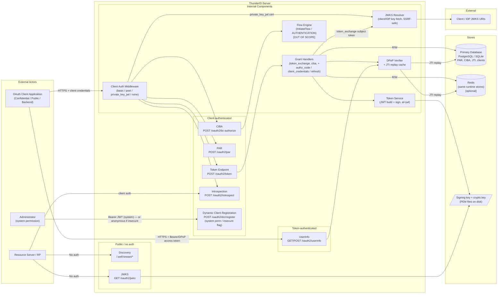

_Diagram 1: Architecture Diagram of the ThunderID OAuth2 / OIDC authentication surface (per-grant authorize/code flow is covered in the Grant Types model)_

The architecture consists of the following core components:

1. **Client Authentication Middleware** — supports `client_secret_basic`, `client_secret_post`, `private_key_jwt`, and `none` (public clients). Each client is restricted to a single allowlisted method. Secrets are verified against salted hashes with constant-time comparison.
2. **Token Endpoint** — `POST /oauth2/token`. Runs client authentication (middleware), then grant-type-specific validation, scope handling, DPoP proof verification, and token issuance. Sets `Cache-Control: no-store`.
3. **Grant Handlers** — the shared dispatcher and the back-channel grants covered here (`token_exchange`, `ciba`) plus the three grant-specific handlers detailed in the Grant Types model.
4. **Token Service** — builds and signs JWT access (`at+jwt`), refresh, and ID tokens with the server signing key.
5. **DPoP Verifier + JTI replay cache** — validates DPoP proofs and binds tokens to client keys; the JTI store provides cross-feature replay protection.
6. **CIBA, PAR, DCR, Introspection, UserInfo, Discovery, JWKS** — the standalone protocol features described as interactions in this document.
7. **JWKS Resolver** — fetches client/IDP public keys for `private_key_jwt` and token-exchange validation, with SSRF protections and a 1 MB response size cap.
8. **Stores** — PAR requests, CIBA requests, JTI replay records, and client records, persisted in the primary database (PostgreSQL/SQLite) or Redis when configured. Signing and at-rest encryption keys are PEM/key files on disk.

## **Data Flow or Sequence Diagram** {#data-flow-or-sequence-diagram}

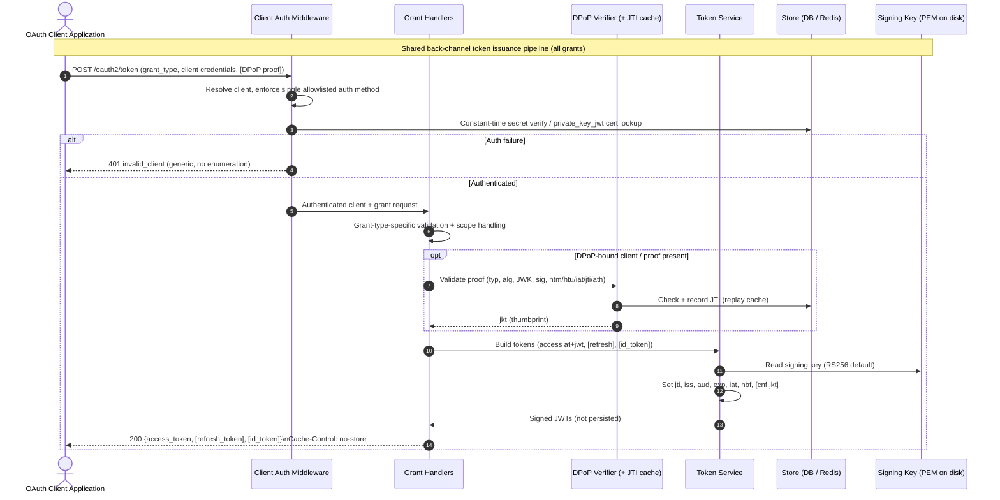

_Diagram 2: Sequence Diagram of the shared back-channel token issuance pipeline (client authentication → grant validation → DPoP → signing)_

**Shared back-channel token issuance lifecycle** (steps common to every grant; grant-specific binding/validation is in the Grant Types model):

1. The client presents its credentials at `POST /oauth2/token`. **Client authentication runs first as middleware**, before any grant handler. The client is resolved, restricted to its single allowlisted auth method, and the secret is verified against a salted hash with constant-time comparison (or, for `private_key_jwt`, the assertion is verified against the registered cert/JWKS with the token endpoint URL as audience).
2. On any authentication failure the endpoint returns a generic `invalid_client` (no distinction between unknown client and wrong secret).
3. The authenticated request is dispatched to the grant handler, which performs its grant-type-specific validation and scope handling.
4. If the client is DPoP-bound (or a proof is supplied), the DPoP verifier fully validates the proof and the JTI is checked/recorded in the replay cache, yielding the key thumbprint (`jkt`).
5. The token service builds and signs the access token (`at+jwt`), optional refresh token, and ID token, each with `jti`, `iss`, `aud`, `exp`, `iat`, `nbf` and the DPoP `cnf.jkt` where applicable. Tokens are returned with `Cache-Control: no-store`. **No token is persisted; revocation before expiry is not possible.**

# **Actors and Resources** {#actors-and-resources}

**Actors**

| Actor (Role) | Description | Roles or Permissions |
| :---- | :---- | :---- |
| OAuth Client Application | Confidential, public (PKCE), or backend/machine clients registered with ThunderID that request tokens on their own or a user's behalf | Per-client grant types, scopes, redirect URIs, auth method |
| Resource Server / Relying Party | Services that consume issued tokens and call introspection / read discovery / JWKS to validate them | N/A (introspection is client-authenticated) |
| Malicious User / Client | An attacker attempting to steal tokens, register rogue clients, replay proofs, enumerate clients/tokens, or cause service disruption | N/A |
| Administrator | Operators who register/configure OAuth clients and the server (signing keys, DCR mode, issuer) | `system` (root system permission) |

**Entitlement Matrix**

| Actor | Authenticate at /oauth2/token | Push PAR / start CIBA | Register client (DCR) | Introspect a token | Call UserInfo | Read discovery / JWKS |
| :---- | :---: | :---: | :---: | :---: | :---: | :---: |
| OAuth Client Application | Yes (own grants) | Yes (client-authenticated) | Yes (if `system` perm, or anyone if `insecure`) | Yes (any registered/authenticated client) | Yes (with valid access token) | Yes |
| Resource Server / RP | No (unless registered client) | No | No | Yes (as authenticated client) | No | Yes |
| Malicious User / Client | Only with stolen/valid credentials | Only with valid client credentials | Only if `insecure=true` or `system` perm obtained | Only with a valid client_id (incl. public `none` client) | Only with a valid access token | Yes |
| Administrator | Yes | Yes | Yes | Yes | Yes | Yes |

**Resources**

| Assets | Description (usage, purpose, Authentication, Authorizations, and Security) |
| :---- | :---- |
| Token endpoint | Issues access/refresh/ID tokens for all supported grant types; client authentication runs first. Client-authenticated (basic/post/private_key_jwt/none). `POST /oauth2/token`. |
| Token service / signing key | Builds and signs stateless JWTs (RS256 default) using the server signing private key (PEM on disk). Tokens are not persisted. |
| CIBA backchannel endpoint | Client-Initiated Backchannel Authentication (poll mode). Client-authenticated; CIBA grant must be allowlisted per client. `POST /oauth2/bc-authorize`. |
| PAR endpoint | Accepts pushed authorization parameters, returns a single-use 256-bit `request_uri`. Client-authenticated. `POST /oauth2/par`. |
| DCR endpoint | Registers OAuth clients. Authenticated by default (root `system` permission); anonymous when `oauth.dcr.insecure=true`. `POST /oauth2/dcr/register`. |
| Introspection endpoint | Reports token active state and metadata. Client-authenticated. `POST /oauth2/introspect`. |
| UserInfo endpoint | Returns OIDC claims gated by scope and per-app allowlist. Bearer- or DPoP-authenticated. `GET`/`POST /oauth2/userinfo`. |
| Discovery & JWKS | Public OIDC/AS metadata and public signing keys. No authentication. `/.well-known/*`, `GET /oauth2/jwks`. |
| DPoP verifier / JTI replay cache | Validates DPoP proofs and provides cross-feature replay protection for proof `jti` values. Internal component. |

**Dependencies**

| Dependency | Description (usage, purpose, Authentication, Authorizations, and Security) |
| :---- | :---- |
| Flow Engine | Internal authentication engine invoked via `InitiateFlow()` for `AUTHENTICATION` flows. It is triggered by both the authorization endpoint (`/oauth2/authorize`, the primary `authorization_code` path — detailed in the *OAuth2 Grant Types* model) and the CIBA backchannel endpoint (`/oauth2/bc-authorize`, detailed here). Returns a signed assertion JWT on completion. Covered by the *ThunderID Flow Execution* threat model. |
| Database (PostgreSQL/SQLite) | Stores OAuth client records (non-secret config), PAR requests, CIBA requests, and JTI replay records. Internal access only. |
| Redis (optional) | Alternative runtime store for the same OAuth runtime artifacts (PAR, CIBA, JTI), providing native TTL eviction and atomic Lua-script operations. Internal access only. |
| Signing key / crypto key files | The JWT signing private key and the AES-GCM at-rest master key are PEM/key files on disk under `ServerHome`. No HSM/KMS integration. Security depends on filesystem permissions. |
| Client / IDP JWKS endpoints | External JWKS URIs fetched by the JWKS resolver to validate `private_key_jwt` client assertions and token-exchange subject tokens. SSRF-protected, response size capped at 1 MB. |
| Credential store (ENTITY) | Client secrets are stored salted-hashed (SHA256/PBKDF2/Argon2id) in `ENTITY.SYSTEM_CREDENTIALS`, verified with constant-time comparison. |

# **Trust Boundaries** {#trust-boundaries}

This section aims to identify the trust boundaries of the threat model.

| ID | Interaction Type | Interaction |
| :---- | :---- | :---- |
| 1 | Untrust → Trust | Client application calls `POST /oauth2/token` with client credentials and a grant. |
| 2 | Untrust → Trust | Client application calls `POST /oauth2/par` (client-authenticated) to push authorization parameters. |
| 3 | Untrust → Trust | Client calls `POST /oauth2/bc-authorize` and polls `POST /oauth2/token` for a CIBA grant. |
| 4 | Untrust → Trust | A caller registers an OAuth client via `POST /oauth2/dcr/register`. |
| 5 | Untrust → Trust | A client / resource server calls `POST /oauth2/introspect`. |
| 6 | Untrust → Trust | A client calls `GET`/`POST /oauth2/userinfo` with an access token. |
| 7 | Untrust → Trust | Anonymous fetch of `/.well-known/*` and `GET /oauth2/jwks`. |
| 8 | Untrust → Trust | A client presents a DPoP proof (at the token endpoint, PAR, or UserInfo) for validation. |
| 9 | Internal | The CIBA service initiates an authentication flow via the flow engine's `InitiateFlow()`. |
| 10 | Internal | OAuth stores (PAR, CIBA, JTI, clients) read/write to the database or Redis. |
| 11 | Internal | Client-secret verification against the ENTITY credential store (salted-hash, constant-time). |
| 12 | Trust → Untrust | The JWKS resolver fetches client/IDP JWKS URIs to validate `private_key_jwt` assertions and token-exchange subject tokens. |
| 13 | Internal | The token service reads the signing private key from disk to sign issued JWTs. |

# **Threats and Mitigations** {#threats-and-mitigations}

## **Inherited or Out-of-Scope Risks** {#inherited-or-out-of-scope-risks}

* The user-authentication flow itself (credential validation, MFA, federated IdP token exchange) — covered by the *ThunderID Flow Execution* threat model.
* Grant-specific authorization and code-issuance logic for `authorization_code`, `client_credentials`, and `refresh_token` — covered by the *OAuth2 Grant Types* threat model.
* Client-side storage and handling of issued tokens (e.g., XSS in the client application extracting an access token from browser storage) — the responsibility of the consuming application. Transport is protected by TLS.
* Security of external identity providers and their token endpoints used during token exchange / federation — covered by the respective protocol specifications.
* Database-level and Redis-level encryption and access controls — assumed to be managed at the infrastructure layer.
* TLS certificate management and configuration — assumed to be managed at the deployment/infrastructure layer.
* Filesystem-level protection of the signing key and AES master key files — assumed to be managed at the deployment/OS layer.
* Resource-server (API) enforcement of the scopes/audiences embedded in issued access tokens — the responsibility of the protected resource consuming the token.

## **Interactions** {#interactions}

### \[01\]: Client authentication at the token endpoint {#01-client-authentication-at-the-token-endpoint}

**Description**

Before any grant handler runs, the token endpoint authenticates the calling client via middleware. ThunderID supports four methods — `client_secret_basic`, `client_secret_post`, `private_key_jwt`, and `none` (public clients) — and each client is restricted to a single allowlisted method. This is the shared gate in front of every back-channel grant.

**Assets Involved**

| Initiator | Intermediate | Target |
| :---- | :---- | :---- |
| OAuth Client Application | Client Auth Middleware | Token Endpoint (pre-grant gate) |

**Data Flow**

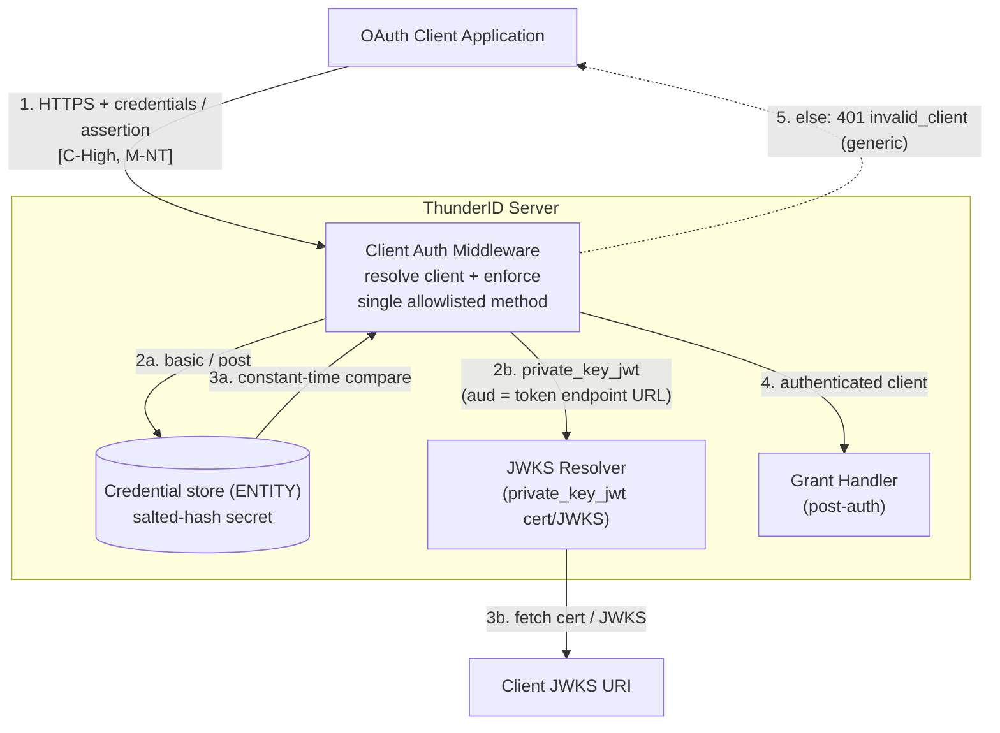

_Diagram 3: Data flow diagram for client authentication at the token endpoint_

**Access Control**

Clients authenticate via a single allowlisted method (`client_secret_basic`, `client_secret_post`, `private_key_jwt`, or `none` for public clients). Client secrets are stored salted-hashed and verified with constant-time comparison; `private_key_jwt` assertions are verified against the client's registered certificate/JWKS with the token endpoint URL enforced as the audience. Authentication failures return a generic `invalid_client` with no distinction between unknown client and wrong secret.

**Security Considerations**

| Area | Response | Comments |
| :---- | :---- | :---- |
| Data Confidentiality | High confidential \[C-High\] | Client credentials and `private_key_jwt` assertions are high-value secrets transiting this gate. |
| Communication Medium | Network interaction \[M-NT\] | |
| Transport Security | **TLS Encryption** | |
| Authentication | **Client authentication (4 methods)** | Per-client single allowlisted method; constant-time secret verification; `private_key_jwt` cert/JWKS with endpoint URL as audience. |
| Accessibility | **Publicly Accessible** | |

**Threat Assessment**

| ID | Category | Threat | Materializable | Mitigations / Comment |
| :---- | :---- | :---- | :---- | :---- |
| 1 | Information Disclosure | Client/token enumeration via differential error responses. | No | All client-auth failures return a generic `invalid_client`, with no distinction between an unknown client and a wrong secret. |
| 2 | Information Disclosure | Timing oracle distinguishing unknown client from wrong secret. | Partial | A not-found client computes no hash, while a known client runs a constant-time hash comparison — a theoretical low-severity timing oracle that could distinguish existence. Materializability is low over the network. Consider a dummy-hash compare on the not-found path. To Check / Tracking issue to be created. |
| 3 | Spoofing | Forged `private_key_jwt` client assertion. | No | The assertion is verified against the client's registered certificate/JWKS, and the token endpoint URL is enforced as the audience, preventing cross-endpoint assertion reuse. |
| 4 | Elevation of Privilege | Client uses an auth method it is not allowed to use (method downgrade). | No | Each client is restricted to a single allowlisted token-endpoint auth method; presenting a different method is rejected. |

### \[02\]: Token issuance and JWT signing {#02-token-issuance-and-jwt-signing}

**Description**

After client authentication and grant validation, the token service builds and signs the issued JWTs. Access tokens carry `typ: at+jwt`; refresh and ID tokens are also signed JWTs. Signing uses the server signing private key (RS256 default). This is the shared issuance/signing pipeline used by every grant.

**Assets Involved**

| Initiator | Intermediate | Target |
| :---- | :---- | :---- |
| Grant Handler | Token Service (JWT builder/signer) | Issued JWTs + Signing Key |

**Data Flow**

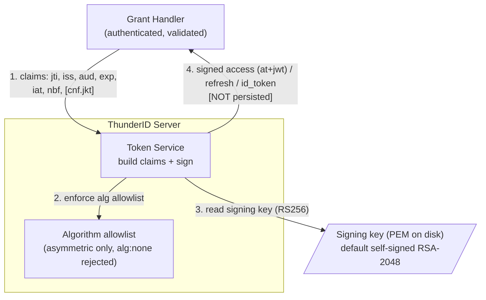

_Diagram 4: Data flow diagram for token issuance and JWT signing_

**Access Control**

The token service is reached only after client authentication and grant validation. Claims are populated from the validated grant context. The signing key is read from disk; the verification algorithm is constrained to the asymmetric key set (no HMAC path).

**Security Considerations**

| Area | Response | Comments |
| :---- | :---- | :---- |
| Data Confidentiality | High confidential \[C-High\] | The issued access/refresh/ID tokens are high-value bearer (or sender-constrained) credentials. The signing private key is the root of trust for the entire component. |
| Communication Medium | Network interaction \[M-NT\] | |
| Transport Security | **TLS Encryption** | |
| Authentication | **Internal (post client-auth + grant validation)** | Reached only after the shared gate \[01\] and grant-specific validation (Grant Types model). |
| Accessibility | **Internal** | Signing key file accessibility is a deployment/OS responsibility. |

**Threat Assessment**

| ID | Category | Threat | Materializable | Mitigations / Comment |
| :---- | :---- | :---- | :---- | :---- |
| 1 | Tampering | Algorithm-confusion / `alg:none` attack on token verification. | No | The verifier rejects `alg:none`; only asymmetric algorithms are in the allowlist and there is no HMAC path, so RSA↔HMAC confusion is not exploitable. |
| 2 | Tampering | Compromise of the signing key forging arbitrary tokens. | Partial | The signing private key is an unencrypted PEM file on disk (no HSM/KMS). Anyone with filesystem read access can forge tokens. The default key is a build-time self-signed RSA-2048 cert (CN=localhost) and **must** be replaced for production. Filesystem protection is a deployment responsibility. |
| 3 | Repudiation / Token Theft | No revocation of issued access or refresh tokens before expiry. | Yes | Tokens are stateless JWTs not persisted anywhere; there is no revocation list, no revocation on logout, and no admin revocation. Compromised tokens (or tokens belonging to a deleted/suspended user or deregistered client) remain valid until `exp`. Token revocation is an in-progress design ([#3321](https://github.com/thunder-id/thunderid/discussions/3321)) proposing a JTI blocklist plus criteria-based bulk revocation. Until then, keep TTLs short (access 3600 s, refresh 86400 s defaults). |
| 4 | Elevation of Privilege | Stale authorization — a token issued before a role/permission/scope change retains the old privileges until expiry. | Yes | Authorization decisions are frozen into the JWT at issuance and there is no revocation, so updating a user's roles/permissions (or withdrawing a scope, suspending/deleting the user, or regenerating a client secret) does **not** affect outstanding access tokens; the old grant persists for up to the access-token lifetime (1 h default), and refresh tokens can re-mint tokens carrying the old grant for up to 24 h. This is an explicit driver of the revocation design ([#3321](https://github.com/thunder-id/thunderid/discussions/3321)). Mitigation today: short TTLs and disabling/rotating the refresh token out of band. |
| 5 | Information Disclosure | Token claims or signing material leaked via logs. | No | Tokens and signing material are not logged by observed statements; `client_id` is masked. Verify no debug path logs token claims. |

### \[03\]: Token exchange grant (RFC 8693) {#03-token-exchange-grant-rfc-8693}

**Description**

`urn:ietf:params:oauth:grant-type:token-exchange` (RFC 8693) at `POST /oauth2/token` exchanges a subject token for a new token (delegation/impersonation). The grant is client-authenticated like every other token-endpoint grant.

**Assets Involved**

| Initiator | Intermediate | Target |
| :---- | :---- | :---- |
| OAuth Client Application | Token Exchange Handler / JWKS Resolver | Token Endpoint + Token Service |

**Data Flow**

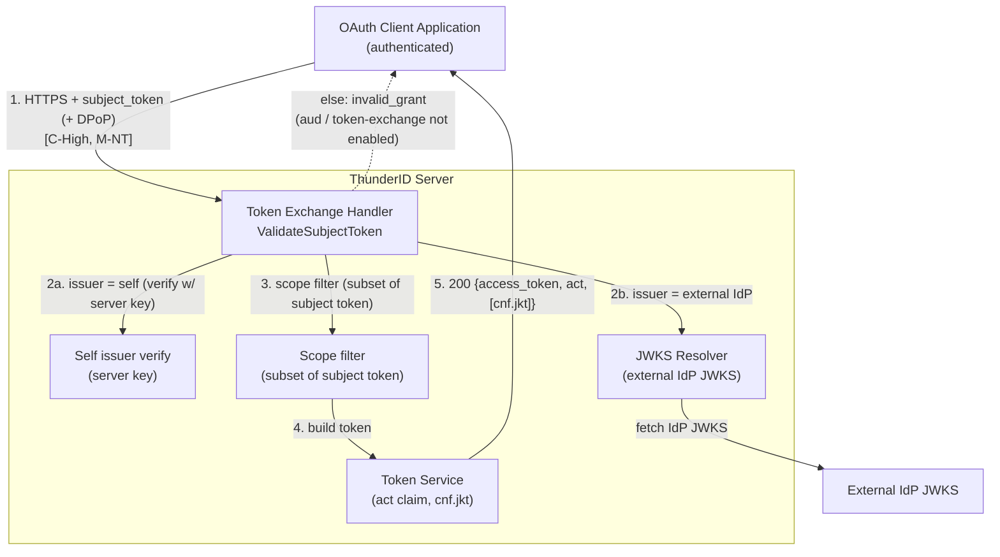

_Diagram 5: Data flow diagram for the token exchange grant_

**Access Control**

The subject token is validated against the self issuer (server signing key) or a configured external IdP's JWKS. For external tokens, the server's issuer must be present in the token's `aud` and token exchange must be explicitly enabled on the IdP. Issued scopes are filtered to a subset of the subject token's scopes; the `act` (actor) claim records the delegation chain; subject-token DPoP `cnf.jkt` binding is enforced.

**Security Considerations**

| Area | Response | Comments |
| :---- | :---- | :---- |
| Data Confidentiality | High confidential \[C-High\] | The subject token and the issued token are high-value credentials carrying subject identity and delegated scopes. |
| Communication Medium | Network interaction \[M-NT\] | |
| Transport Security | **TLS Encryption** | |
| Authentication | **Client authentication + subject-token verification** | Client-authenticated; subject token verified against self or configured external IdP JWKS. |
| Accessibility | **Publicly Accessible (client-authenticated)** | |

**Threat Assessment**

| ID | Category | Threat | Materializable | Mitigations / Comment |
| :---- | :---- | :---- | :---- | :---- |
| 1 | Elevation of Privilege | Token exchange used to escalate privilege or impersonate via a forged/borrowed subject token. | No | `ValidateSubjectToken` verifies the subject token against the self issuer (server key) or a configured external IdP's JWKS; for external tokens the server's issuer must be in the token's `aud`, and token exchange must be explicitly enabled on the IdP. The `act` (actor) claim records the delegation chain. |
| 2 | Elevation of Privilege | Exchange yields broader scopes than the subject token held. | No | Issued scopes are filtered to a subset of the subject token's scopes; subsequent Resource Server downscoping also applies. |
| 3 | Spoofing | Subject token minted for a different audience accepted for exchange. | No | External subject tokens require the server's issuer to be present in `aud`; self-issued tokens are bound to the server key. |
| 4 | Tampering | DPoP-bound subject token replayed without proof-of-possession. | No | When the subject token carries a `cnf.jkt`, the subject-token DPoP binding is enforced during exchange. |
| 5 | Server-Side Request Forgery | External IdP JWKS fetch coerced to an internal URL. | No | The JWKS resolver applies SSRF protections and caps responses at 1 MB (see \[08\] and trust boundary 12). |

### \[04\]: CIBA backchannel authentication {#04-ciba-backchannel-authentication}

**Description**

`POST /oauth2/bc-authorize` initiates a Client-Initiated Backchannel Authentication request (poll mode). The client is authenticated and must have the CIBA grant allowlisted. The user is identified from a hint and authenticated out-of-band via a flow; the client polls `POST /oauth2/token` with the `auth_req_id` until authentication completes.

**Assets Involved**

| Initiator | Intermediate | Target |
| :---- | :---- | :---- |
| OAuth Client Application | Flow Engine (out-of-band auth) | CIBA Service + Token Endpoint |

**Data Flow**

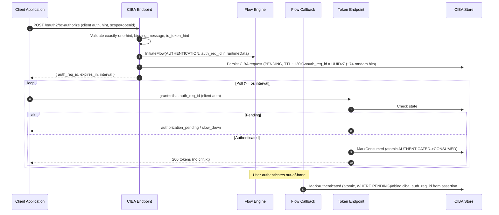

_Diagram 6: Sequence diagram for CIBA backchannel authentication (poll mode)_

**Access Control**

The bc-authorize endpoint is client-authenticated and requires the CIBA grant to be allowlisted per client. The `auth_req_id` is bound to the authenticated client at the token endpoint. The callback binds the assertion to the specific request via a `ciba_auth_req_id` claim and uses atomic state transitions (`MarkAuthenticated`, `MarkConsumed`) to prevent double-callback and double-consume races.

**Security Considerations**

| Area | Response | Comments |
| :---- | :---- | :---- |
| Data Confidentiality | High confidential \[C-High\] | The flow authenticates a user and issues tokens delivered to the polling client. |
| Communication Medium | Network interaction \[M-NT\] | |
| Transport Security | **TLS Encryption** | |
| Authentication | **Client authentication + assertion signature** | bc-authorize and token polling are client-authenticated; the callback verifies the assertion signature. |
| Accessibility | **Publicly Accessible (client-authenticated)** | |

**Threat Assessment**

| ID | Category | Threat | Materializable | Mitigations / Comment |
| :---- | :---- | :---- | :---- | :---- |
| 1 | Spoofing | `auth_req_id` guessed by an attacker to retrieve another user's tokens. | No | `auth_req_id` is bound to the authenticated polling client and to the assertion's `ciba_auth_req_id` claim. The polling client must also authenticate. (See ID 2 for the entropy nuance.) |
| 2 | Spoofing | `auth_req_id` has lower entropy than other identifiers (UUIDv7, ~74 random bits, time-ordered). | To Check | Unlike PAR's 256-bit random `request_uri`, CIBA uses UUIDv7. Client binding is the primary mitigation, but consider using a fully-random identifier to match PAR. Tracking issue to be created. |
| 3 | Replay | CIBA request consumed twice to issue duplicate token sets. | No | `MarkConsumed` is an atomic `AUTHENTICATED → CONSUMED` transition (SQL conditional UPDATE / Redis Lua); a concurrent double-poll loses the race and gets `invalid_grant`. |
| 4 | Tampering | A narrow-scope assertion replayed against a broader CIBA request. | No | The callback rejects the assertion unless its `ciba_auth_req_id` claim matches the stored request. |
| 5 | Tampering | CIBA-issued tokens are not DPoP-bound even for DPoP clients. | Yes | `issueTokens` builds the access token with no `cnf.jkt`. CIBA tokens are never sender-constrained. Tracking issue to be created. |
| 6 | Tampering | Audience check on the callback assertion silently skipped on client-lookup failure. | To Check | If the client lookup fails, the callback proceeds without the `aud` defense-in-depth check (signature is still verified). Confirm this path cannot be triggered by an attacker. |
| 7 | Denial of Service | Polling abuse / `slow_down` not strictly enforced. | To Check | The poll interval uses a hardcoded constant and `LastPolledAt` is updated on every poll including too-fast ones; verify the slow-down logic correctly throttles aggressive pollers. No global rate limiting. |

### \[05\]: Pushed Authorization Requests (PAR) {#05-pushed-authorization-requests-par}

**Description**

`POST /oauth2/par` (RFC 9126) lets a client push authorization request parameters directly to the server (client-authenticated) in exchange for a single-use `request_uri` that is later presented at `/oauth2/authorize`.

**Assets Involved**

| Initiator | Intermediate | Target |
| :---- | :---- | :---- |
| OAuth Client Application | Client Auth Middleware | PAR Service + PAR Store |

**Data Flow**

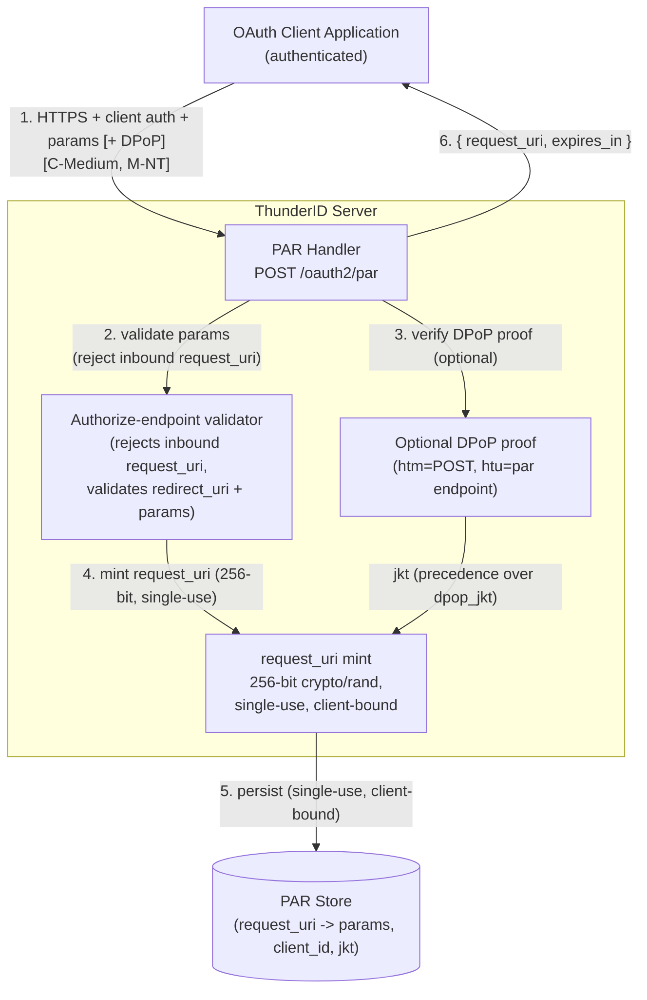

_Diagram 7: Data flow diagram for Pushed Authorization Requests (PAR)_

**Access Control**

PAR is client-authenticated; the returned `request_uri` is bound to the authenticating client and is single-use. The endpoint reuses the authorize-endpoint validator for all pushed parameters and rejects an inbound `request_uri` parameter in the push. An optional DPoP proof is verified and its derived `jkt` is stored and bound to the eventual code, taking precedence over a supplied `dpop_jkt`.

**Security Considerations**

| Area | Response | Comments |
| :---- | :---- | :---- |
| Data Confidentiality | Medium confidential \[C-Medium\] | Authorization parameters (scopes, claims, redirect URI, optional DPoP jkt) are pushed; the returned `request_uri` is a capability reference. |
| Communication Medium | Network interaction \[M-NT\] | |
| Transport Security | **TLS Encryption** | |
| Authentication | **Client authentication** | Required; the `request_uri` is bound to the authenticating client. |
| Accessibility | **Publicly Accessible (client-authenticated)** | |

**Threat Assessment**

| ID | Category | Threat | Materializable | Mitigations / Comment |
| :---- | :---- | :---- | :---- | :---- |
| 1 | Spoofing | `request_uri` guessed to inject authorization parameters. | No | The `request_uri` carries 256-bit `crypto/rand` entropy (contrast with CIBA's UUIDv7). |
| 2 | Replay | `request_uri` reused for multiple authorization requests. | No | Single-use: SQL consume is a SELECT-with-expiry then DELETE (racing delete treated as already-consumed); Redis uses atomic `GETDEL`. |
| 3 | Spoofing | One client redeems another client's `request_uri`. | No | `ResolvePushedAuthorizationRequest` consumes the entry and rejects if the resolving client_id differs from the stored client. |
| 4 | Tampering | Inbound `request_uri` parameter smuggled into a PAR push. | No | The PAR endpoint rejects a `request_uri` parameter in the pushed request and validates the redirect URI and all parameters using the same authorize-endpoint validator. |
| 5 | Tampering | DPoP binding bypass when pushing via PAR. | No | An optional DPoP proof at PAR is verified (`htm=POST`, `htu=par endpoint`) and the resulting jkt is stored and bound to the eventual code; the proof-derived jkt takes precedence over a supplied `dpop_jkt`. |

### \[06\]: Dynamic Client Registration (DCR) {#06-dynamic-client-registration-dcr}

**Description**

`POST /oauth2/dcr/register` (RFC 7591) registers OAuth clients. By default it requires the root `system` permission; setting `oauth.dcr.insecure=true` removes all authentication and allows anonymous registration.

**Assets Involved**

| Initiator | Intermediate | Target |
| :---- | :---- | :---- |
| Administrator / Caller | DCR Authorization Check | DCR Service + Application Store |

**Data Flow**

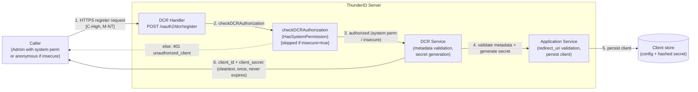

_Diagram 8: Data flow diagram for Dynamic Client Registration_

**Access Control**

When `oauth.dcr.insecure=false` (the default), the handler requires the caller to hold the root `system` permission (validated via a bearer JWT — since `/oauth2/**` is a public path the global middleware does not block it, but anonymous callers get empty permissions and are rejected with 401). When `insecure=true`, the authorization check is skipped entirely and anyone can register a client.

**Security Considerations**

| Area | Response | Comments |
| :---- | :---- | :---- |
| Data Confidentiality | High confidential \[C-High\] | The generated `client_secret` is returned in cleartext (once) in the response. |
| Communication Medium | Network interaction \[M-NT\] | |
| Transport Security | **TLS Encryption** | |
| Authentication | **Root `system` permission (default) / none (insecure)** | Governed by the `oauth.dcr.insecure` flag. |
| Accessibility | **Publicly reachable path; authorization-gated by default** | |

**Threat Assessment**

| ID | Category | Threat | Materializable | Mitigations / Comment |
| :---- | :---- | :---- | :---- | :---- |
| 1 | Elevation of Privilege | Anonymous open client registration when `oauth.dcr.insecure=true`. | Yes | With the flag enabled, anyone can register clients (choosing grant types, redirect URIs, DPoP binding) with no rate limiting, no software statement, and no initial access token. The flag defaults to `false` (secure). Document that it must never be enabled in production. Tracking issue to be created. |
| 2 | Tampering | Rogue client registered with an attacker-controlled redirect URI. | No (default) / Yes (insecure) | Redirect URIs are validated by the application service (full qualification, fragment rejection). Under secure mode only `system`-permission holders can register; under insecure mode this becomes an open phishing/token-theft vector. |
| 3 | Spoofing | `none` (public) clients created at will, then used to introspect tokens. | Yes | DCR can create public (`none`-auth) clients, which forces PKCE — but a public client with a valid `client_id` can still authenticate to the introspection endpoint (see \[07\]). Compounded under insecure mode. |
| 4 | Information Disclosure | Client secrets never expire (`client_secret_expires_at: 0`). | Yes | Generated secrets are 256-bit and returned once in cleartext, but never expire and there is no RFC 7592 client-configuration endpoint or registration access token to rotate/revoke them. Mild hygiene concern; consider secret lifetimes. Tracking issue to be created. |
| 5 | Elevation of Privilege | All anonymously/DCR-registered clients land in the root OU. | To Check | An in-code TODO notes `ou_id` defaults to the first root OU for DCR apps. Verify the OU/tenant placement is appropriate and does not over-privilege registered clients. |
| 6 | Denial of Service | Registration flooding exhausts client storage. | Yes | No rate limiting on registration. Under insecure mode this is unauthenticated. Apply infrastructure throttling and keep DCR secured. |

### \[07\]: Token introspection and UserInfo {#07-token-introspection-and-userinfo}

**Description**

`POST /oauth2/introspect` (RFC 7662) reports whether a token is active and its metadata, to client-authenticated callers. `GET`/`POST /oauth2/userinfo` returns OIDC claims to a caller presenting a valid access token (bearer or DPoP).

**Assets Involved**

| Initiator | Intermediate | Target |
| :---- | :---- | :---- |
| Client / Resource Server | Client Auth / Access-token validation | Introspection Service / UserInfo Service |

**Data Flow**

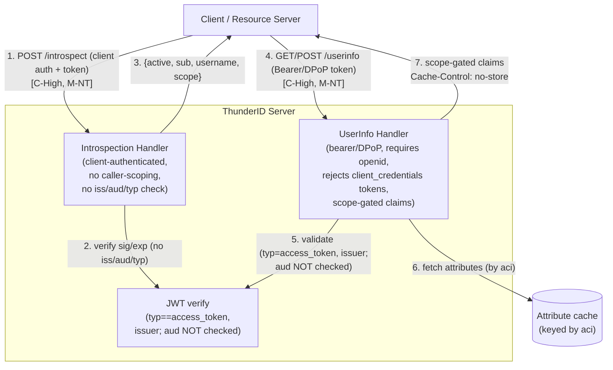

_Diagram 9: Data flow diagram for token introspection and UserInfo_

**Access Control**

Introspection is client-authenticated but performs no caller-scoping — any registered/authenticated client (including a public `none` client with a valid `client_id`) can introspect any token, and it performs no issuer/audience/`typ` validation, so any unexpired server-signed JWT reads as active. UserInfo requires a valid access token (bearer or DPoP), enforces the `openid` scope, rejects `client_credentials` tokens, gates non-`sub` claims by scope→claim mapping and a per-app attribute allowlist, but does **not** validate the access token's audience. A DPoP-bound token presented under the `Bearer` scheme is rejected as a downgrade.

**Security Considerations**

| Area | Response | Comments |
| :---- | :---- | :---- |
| Data Confidentiality | High confidential \[C-High\] | Both endpoints reveal subject identity, scopes, and user attribute claims. |
| Communication Medium | Network interaction \[M-NT\] | |
| Transport Security | **TLS Encryption** | |
| Authentication | **Introspect: client auth; UserInfo: access token** | UserInfo enforces `openid` scope, rejects `client_credentials` tokens, and rejects DPoP-token-under-Bearer downgrade. |
| Accessibility | **Publicly Accessible** | UserInfo sets `Cache-Control: no-store`. |

**Threat Assessment**

| ID | Category | Threat | Materializable | Mitigations / Comment |
| :---- | :---- | :---- | :---- | :---- |
| 1 | Information Disclosure | Any authenticated client can introspect any token (no caller-scoping / ownership check). | Yes | Introspection does not check that the caller owns or is the audience of the token. A public (`none`) client with a valid `client_id` can introspect arbitrary tokens, leaking `sub`, `username`, and `scope`. Consider restricting introspection to the token's audience/owner. Tracking issue to be created. |
| 2 | Information Disclosure | Introspection over-accepts tokens (no issuer/audience/`typ` validation). | Yes | The verify call passes empty issuer/audience and performs no `typ` check, so any unexpired server-signed JWT (access, refresh, ID-token-style) reads as `active:true`. Tracking issue to be created. |
| 3 | Spoofing | An access token minted for a different audience accepted at UserInfo. | Yes | `ValidateAccessToken` checks issuer and `typ==access_token` but does not validate audience. A token for any audience is accepted at UserInfo. Tracking issue to be created. |
| 4 | Information Disclosure | UserInfo returns claims beyond the granted scope. | No | UserInfo requires `openid`, rejects `client_credentials` tokens, and gates non-`sub` claims by scope→claim mapping and a per-app attribute allowlist; claims are fetched from the attribute cache keyed by the token's `aci`. |
| 5 | Spoofing | DPoP-bound token replayed at UserInfo as a bearer token. | No | A DPoP-bound token presented under the `Bearer` scheme is rejected as a downgrade; the DPoP path enforces proof binding (key/`htm`/`htu`/`ath`). |
| 6 | Information Disclosure | Introspection leaks validity of arbitrary tokens to unauthenticated callers. | No | Introspection is client-authenticated and fails closed (`{active:false}`) on any verification failure. (Note revocation is unimplemented — a revoked-but-unexpired token still reads active; see the token model in \[02\].) |

### \[08\]: Public OIDC metadata and JWKS {#08-public-oidc-metadata-and-jwks}

**Description**

`GET /.well-known/openid-configuration`, `GET /.well-known/oauth-authorization-server`, and `GET /oauth2/jwks` expose provider metadata and public signing keys without authentication. The JWKS resolver that fetches *external* client/IDP JWKS for `private_key_jwt` and token-exchange validation is covered here as well (its SSRF protections).

**Assets Involved**

| Initiator | Intermediate | Target |
| :---- | :---- | :---- |
| Any client / relying party | | Discovery Service / JWKS Service |

**Data Flow**

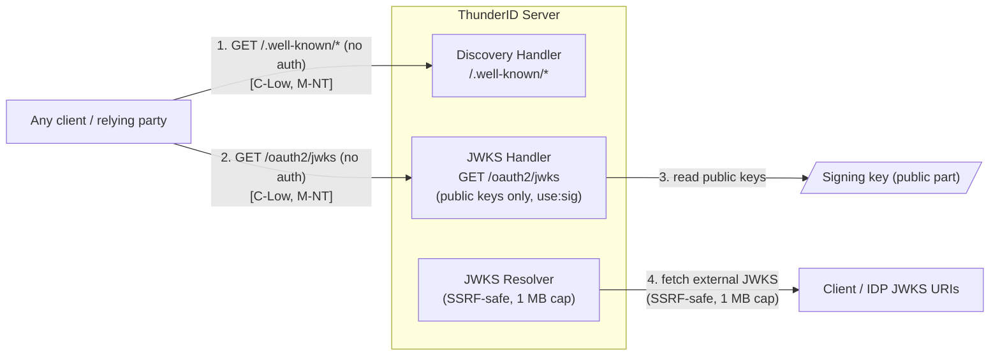

_Diagram 10: Data flow diagram for public OIDC metadata and JWKS_

**Access Control**

Discovery and JWKS are public by design. JWKS exposes only public key material. The external JWKS resolver applies SSRF protections and caps responses at 1 MB.

**Security Considerations**

| Area | Response | Comments |
| :---- | :---- | :---- |
| Data Confidentiality | Low confidential \[C-Low\] | Only public metadata and public keys are exposed — no secrets. |
| Communication Medium | Network interaction \[M-NT\] | |
| Transport Security | **TLS Encryption** | |
| Authentication | **None (public by design)** | |
| Accessibility | **Publicly Accessible** | |

**Threat Assessment**

| ID | Category | Threat | Materializable | Mitigations / Comment |
| :---- | :---- | :---- | :---- | :---- |
| 1 | Information Disclosure | Private key material exposed via JWKS. | No | JWKS returns only public keys (`use:sig`) with `kid`, `x5c`, `x5t`, `x5t#S256`; no private material is serialized. |
| 2 | Information Disclosure | Metadata reveals attack surface (endpoints, supported algs). | No | Standard, expected OIDC/AS metadata exposure; reveals no secrets. Acceptable per the specifications. |
| 3 | Denial of Service | Unauthenticated metadata/JWKS endpoints flooded. | Yes | No rate limiting. Responses are static/cacheable; apply caching and infrastructure throttling. |
| 4 | Server-Side Request Forgery | JWKS resolver coerced to fetch attacker-controlled internal URLs. | No | The resolver fetching client/IDP JWKS URIs applies SSRF protections and caps responses at 1 MB. (See trust boundary 12.) |

### \[09\]: DPoP proof validation and token binding {#09-dpop-proof-validation-and-token-binding}

**Description**

DPoP (RFC 9449) is the shared sender-constraining machinery used at the token endpoint, PAR, and UserInfo. When a client is DPoP-bound (or presents a proof), the DPoP verifier fully validates the proof and binds the issued/presented token to the client-held key via the `cnf.jkt` claim.

**Assets Involved**

| Initiator | Intermediate | Target |
| :---- | :---- | :---- |
| OAuth Client Application | DPoP Verifier | JTI Replay Cache + Token (`cnf.jkt`) |

**Data Flow**

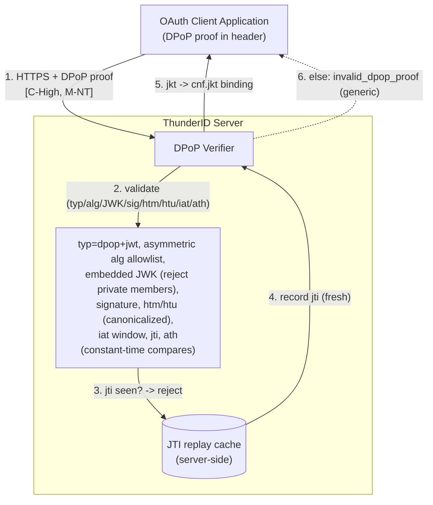

_Diagram 11: Data flow diagram for DPoP proof validation and token binding_

**Access Control**

The DPoP verifier validates `typ` (`dpop+jwt`), restricts `alg` to the asymmetric allowlist, parses the embedded JWK while rejecting any private-key members, verifies the signature, validates canonicalized `htm`/`htu`, the `iat` window, the `jti` against the server-side replay cache, and `ath` against the access-token hash, all with constant-time comparisons. The validated key thumbprint is bound to the token via `cnf.jkt`.

**Security Considerations**

| Area | Response | Comments |
| :---- | :---- | :---- |
| Data Confidentiality | High confidential \[C-High\] | The proof binds high-value tokens to a client-held key; failure undermines sender-constraining. |
| Communication Medium | Network interaction \[M-NT\] | |
| Transport Security | **TLS Encryption** | |
| Authentication | **Proof-of-possession (DPoP)** | Validates key, `htm`/`htu`/`iat`/`jti`/`ath`; JTI replay cache. |
| Accessibility | **Publicly Accessible (where DPoP is offered)** | |

**Threat Assessment**

| ID | Category | Threat | Materializable | Mitigations / Comment |
| :---- | :---- | :---- | :---- | :---- |
| 1 | Tampering | Sender-constrained (DPoP) token replayed by a different party. | No | When DPoP is configured and the client is DPoP-bound, the proof is fully validated (signature, `htm`/`htu`/`iat`/`jti`/`ath`) and the token's `cnf.jkt` is enforced. A server-side JTI replay cache prevents proof reuse. |
| 2 | Tampering | Forged proof with `alg:none` or a smuggled private key in the embedded JWK. | No | `alg` is restricted to the asymmetric allowlist; the embedded JWK is rejected if it carries private-key members. |
| 3 | Replay | DPoP proof replayed within its validity window. | No | The proof `jti` is checked and recorded in a server-side replay cache (shared cross-feature); a reused `jti` is rejected. The `iat` window bounds the acceptance period. |
| 4 | Tampering | DPoP not enforced — token issued without sender-constraining when expected. | To Check | DPoP is not required globally (`dpop.required=false` default) and relies on per-client `DPoPBoundAccessTokens`. CIBA-issued tokens are never DPoP-bound even for DPoP clients (see \[04\]). Confirm per-client DPoP enforcement matches policy. |
| 5 | Tampering | Absence of a DPoP nonce allows pre-generation/relay of proofs. | Yes | ThunderID does not issue or require a DPoP `nonce`, so the server cannot force proof freshness beyond the `iat` window. Consider implementing server-provided nonces for high-value flows. Tracking issue to be created. |

# **Review Checklist** {#review-checklist}

## **Security Considerations** {#security-considerations}

| Security Consideration | State | Comments |
| :---- | :---- | :---- |
| Are all inputs and outputs validated? | Partial | Token-endpoint requests are validated per grant; PAR reuses the authorize-endpoint validator; CIBA validates exactly-one-hint and binding parameters; DCR validates client metadata and redirect URIs. The generic scope validator is a no-op, but each grant constrains scopes contextually; the residual gap is the absent registered-scope allowlist. |
| Are rate limits in place where necessary? | No | No rate limiting or bot detection anywhere in the product. `/oauth2/token`, `/oauth2/par`, `/oauth2/bc-authorize`, `/oauth2/dcr/register`, `/oauth2/introspect`, and the public metadata endpoints can all be flooded. |
| Are proper authentication and authorizations in place before granting access to resources based on least privilege and business needs? | Partial | Token, PAR, CIBA, and introspection endpoints are client-authenticated; UserInfo requires a valid access token; DCR requires the root `system` permission by default. Gaps: introspection has no caller-scoping (any client can introspect any token); UserInfo does not validate audience; the `oauth.dcr.insecure` flag can open anonymous registration. |
| Are permissions, roles, and entitlements defined (based on least privilege) and validated in both the front end and back end? | Partial | Per-client grant-type and token-endpoint-auth-method allowlists are enforced. DCR authorization uses `HasSystemPermission` (root `system`). The generic scope validator does not enforce a client scope allowlist; grant-specific scoping is detailed in the Grant Types model. |
| Are proper isolations in place between components to ensure least-privilege access and reduce the blast radius against lateral movement? | Partial | OAuth endpoints are public by design and each enforces its own auth scheme at the endpoint level (standard OAuth/OIDC), rather than via the global middleware. The residual isolation concern is that the signing key and AES master key are plaintext files on disk (filesystem-level protection is a deployment responsibility). |
| Have any default credentials been changed, and are the default superuser/root accounts not in use? | To Check | The default JWT signing key is a build-time self-signed RSA-2048 cert (CN=localhost) stored unencrypted on disk and **must** be replaced for production. As with the rest of the product, `setup.sh` may default the admin account to `admin/admin`. |
| Has the implementation been carried out in accordance with best-practice guidelines (OWASP/Kubernetes/Vendor/Technology provider)? | Partial | Client secrets are 256-bit and verified in constant time; `private_key_jwt` enforces endpoint URL as audience; DPoP proofs are fully validated with a JTI replay cache; PAR uses 256-bit single-use client-bound `request_uri`; `alg:none` is rejected (asymmetric-only allowlist); `Cache-Control: no-store` on token/UserInfo responses. Gaps vs. OAuth 2.1 / BCP: no token revocation, introspection over-acceptance, no DPoP nonce, no rate limiting. |
| Is the source code kept private? | No | ThunderID is an open-source product licensed under Apache 2.0. |
| Is the source code or IaC code review being conducted, and have the findings been addressed? | Yes | Will be covered from the product scan. |
| Is Static/IaC scanning conducted on the source code, and are findings addressed? | Yes | Will be covered from the product scan. |
| Is Software Composition Analysis being conducted or integrated into the source code repository, and are findings addressed? (Examples include FOSSA, JFrog XRay, or Trivy) | Yes | Will be covered from the product scan. |
| Is Dynamic scanning conducted on the non-production setup, and are findings addressed? | Yes | Will be covered from the product scan. |
| Are audit logs generated for critical functionalities and made available to administrators to track critical events? | To Check | Verify which OAuth events (token issuance, client registration, introspection) emit structured audit events versus debug logs. Client registration and token issuance are high-value events that should be auditable. |
| Do audit logs for critical configuration changes include a record of the differences between the old and new versions? | To Check | Verify whether client (OAuth app) create/update operations record before/after state and initiator identity. |
| Has a business impact analysis (BIA) been conducted on development to identify resilience requirements such as maximum tolerable downtime (MTTD), recovery point objective (RPO), and recovery time objective (RTO)? Additionally, are there implementations in place to address resilience objectives via high availability, backups, backup verification, disaster recovery options, health-check endpoints, and end-user messaging? | Partial | ThunderID provides liveness/readiness endpoints and graceful shutdown. Token issuance is stateless (no token store to back up) but depends on the signing key file and the runtime store for PAR/CIBA/JTI. HA, replication, backups, and key recovery are deployment-level responsibilities; a formal BIA/DR plan is not confirmed. |
| Are data in transit and data at rest encrypted? | Partial | TLS is configurable (minimum TLS 1.2) but optional — the server can start in plain HTTP. Client secrets are salted-hashed at rest. The signing private key and AES master key are unencrypted files on disk. |
| Are sensitive data, such as credentials and keys, stored in secret stores like key vaults? | No | The signing key and AES at-rest master key are PEM/key files on disk; there is no HSM/KMS/key-vault integration. Client secrets are salted-hashed (not in a vault). |
| Have you ensured that personal, sensitive, or confidential data is not logged in the logs? | Partial | `client_id` is masked in logs; secrets, assertions, and tokens are not logged by observed statements. Error responses are sanitized (generic `invalid_client`, DPoP errors collapsed, `server_error` detail replaced). Verify no debug path logs token claims or user attributes. |
| Have we provided users with proper instructions on secure usage? | To Check | Deployment docs should cover: replacing the default signing key, enforcing HTTPS/TLS, never enabling `oauth.dcr.insecure` in production, securing the signing/crypto key files and the runtime store, configuring short token TTLs, and enabling DPoP where appropriate. |
| Is client authentication free from enumeration and timing oracles? | Partial | All client-auth failures return a generic `invalid_client`. Constant-time comparison is used for secret verification, but a not-found client computes no hash — a theoretical low-severity timing oracle that could distinguish client existence (see \[01\]-3). |
| Is token signature verification safe from algorithm confusion? | Yes | `alg:none` rejected; only asymmetric algorithms in the allowlist; no HMAC path, so RSA↔HMAC confusion is not exploitable. The verify alg is read from the token header but constrained to the asymmetric key set. |
| Are issued tokens revocable? | No | Access and refresh tokens are stateless JWTs with no server-side store and no revocation list. Tokens are valid until natural expiry; there is no revocation on logout or admin revocation. Consequently, role/permission/scope changes do not affect already-issued tokens (stale authorization). Token revocation is an in-progress design ([#3321](https://github.com/thunder-id/thunderid/discussions/3321)) proposing a JTI blocklist plus criteria-based bulk revocation (user lifecycle, client deletion, permission changes). Mitigation today: keep TTLs short. |
| Is DPoP proof validation complete and replay-protected? | Yes | When configured, DPoP validates `typ`, `alg` (asymmetric only), the embedded JWK (rejecting private members), signature, `htm`/`htu` (canonicalized), `iat` window, `jti`, and `ath`, with constant-time comparisons and a server-side JTI replay cache. Gaps: no DPoP nonce; CIBA tokens are not DPoP-bound; DPoP is not required by default. |
| Is the token exchange grant (RFC 8693) safe from privilege escalation? | Yes | The subject token is verified against the self issuer or a configured external IdP JWKS (external requires the server issuer in `aud` and token exchange enabled on the IdP); issued scopes are filtered to a subset of the subject token's; the `act` claim records delegation; subject-token DPoP binding is enforced. |
| Is PAR safe from request_uri guessing, replay, and cross-client redemption? | Yes | 256-bit `crypto/rand` single-use `request_uri`, bound to the authenticating client, rejecting inbound `request_uri` params and reusing the authorize validator; optional DPoP binding takes precedence over a supplied `dpop_jkt`. |

## **Vulnerability Management**

| Vulnerability Management | Response | Comments |
| :---- | :---- | :---- |
| How are we planning to address product vulnerabilities, and what's the frequency of patching? | To Check | Verify patching cadence for ThunderID server and its Go dependencies. |
| How are we planning to address deployment vulnerabilities, and what's the frequency of patching? | To Check | Verify patching cadence for deployment infrastructure (database, Redis, OS, container images). |
| Are there any **End of Life or End of Service components** being used? | No | ThunderID uses Go latest stable version. PostgreSQL, SQLite, and Redis are actively maintained. |

## **Privacy Considerations** {#privacy-considerations}

**This is to be filled out only if the development requires processing of Personal Data**.

| Privacy Consideration | State | Comments |
| :---- | :---- | :---- |
| Is the purpose and legal basis for the processing of personal data clearly defined? | To Check | The OAuth component processes user identity and attribute claims (via assertions, ID tokens, and UserInfo). Verify purpose and legal basis. |
| Is personal data being stored securely? | To Check | User claims transit through assertions and the attribute cache (keyed by `aci`). Issued tokens are not persisted, but CIBA/PAR requests in the runtime store may reference user identity. Verify encryption at rest and access controls. |
| Are privacy policies updated to reflect any new personal data processing or changes to purpose and legal basis? | To Check | |
| Is access to personal data being granted based on the need to know? | Partial | UserInfo gates claims by scope and a per-app allowlist. However, introspection has no caller-scoping — any authenticated client can read `sub`/`username` for arbitrary tokens. |
| Are data retention requirements considered? | Yes | CIBA requests (~120 s), PAR requests (configurable), and JTI replay records have short TTLs. Tokens expire by `exp`. Review against retention policy. |
| Is there a process for disposing of personal data collected upon request in a timely manner while meeting retention requirements? | To Check | Since tokens are stateless and unrevocable, verify how personal data exposure via outstanding tokens is handled on a deletion request. |
| Have you added relevant records in "[WSO2 Data Inventory](https://docs.google.com/spreadsheets/d/1kGVhgvaAi1XYtflf5I_r6bcZQqdimRmm2VXf221FbKY/edit?gid=986734575#gid=986734575)" or [\[Cloud\] Data Storages](https://docs.google.com/spreadsheets/d/1TFajRmy3YLuYkZxNyJOkSuE9orjFcuHLmLWxvT1HWnY/edit?gid=224115104#gid=224115104) (for clouds) related to the processing of personal data? | To Check | |

# **Threat Model Consultation Sessions** {#threat-model-consultation-sessions}

Session 1:

* Date: TBD
* Participants:
* Session recording: \[LINK\]
* Notes:
  *
* Action Items:
- [ ]

Session 2:

* Date: TBD
* Participants:
* Session recording: \[LINK\]
* Notes:
  *
* Action Items:
- [ ]

# **Risk Registry Entries** {#risk-registry-entries}

The following threats were assessed as materializable and require risk registry entries with tracking GitHub issues:

**Active risks:**

- [ ] \[01\]-1: No rate limiting / lockout on client authentication at `/oauth2/token`. (Tracking issue to be created.)
- [ ] \[02\]-2 / Checklist: Default JWT signing key is a build-time self-signed cert stored unencrypted on disk; no HSM/KMS. Must be replaced for production. (Tracking issue to be created.)
- [ ] \[02\]-3: No revocation of issued access/refresh tokens before expiry (stateless JWTs, no token store). Token revocation design in progress. ([#3321](https://github.com/thunder-id/thunderid/discussions/3321))
- [ ] \[02\]-4: Stale authorization — role/permission/scope changes (and user lifecycle / client-secret regeneration) do not affect already-issued tokens until expiry (access 1 h, refresh 24 h default). Addressed by the same revocation design (bulk/criteria-based revocation). ([#3321](https://github.com/thunder-id/thunderid/discussions/3321))
- [ ] \[03\]-1: `oauth.dcr.insecure=true` enables anonymous open client registration with no rate limiting or software statement. (Tracking issue to be created.)
- [ ] \[06\]-4: DCR client secrets never expire and there is no RFC 7592 client-configuration endpoint to rotate/revoke them. (Tracking issue to be created.)
- [ ] \[04\]-2: CIBA `auth_req_id` uses UUIDv7 (~74 random bits) instead of a fully-random identifier like PAR. (Tracking issue to be created.)
- [ ] \[04\]-5: CIBA-issued tokens are never DPoP-bound even for DPoP clients. (Tracking issue to be created.)
- [ ] \[07\]-1: Token introspection has no caller-scoping — any authenticated client (including public `none` clients) can introspect arbitrary tokens. (Tracking issue to be created.)
- [ ] \[07\]-2: Introspection performs no issuer/audience/`typ` validation — any unexpired server-signed JWT reads as active. (Tracking issue to be created.)
- [ ] \[07\]-3: UserInfo does not validate the access token's audience. (Tracking issue to be created.)
- [ ] \[08\]-3 / Checklist: No rate limiting on unauthenticated discovery/JWKS endpoints (and across the whole component). (Tracking issue to be created.)
- [ ] \[09\]-5: No DPoP nonce — the server cannot force proof freshness beyond the `iat` window. (Tracking issue to be created.)

**To-check items requiring confirmation:**

- ~~\[01\]-3~~: Not-found client computes no hash — confirm whether the timing difference is a usable enumeration oracle over the network and whether a dummy-hash compare is warranted.
- ~~\[04\]-6~~: CIBA callback audience check skipped on client-lookup failure — confirm not attacker-triggerable.
- ~~\[04\]-7~~: CIBA `slow_down` enforcement — confirm aggressive pollers are correctly throttled.
- ~~\[06\]-5~~: DCR-registered clients default to the first root OU — confirm OU/tenant placement does not over-privilege.
- ~~\[09\]-4~~: DPoP not required by default — confirm per-client `DPoPBoundAccessTokens` enforcement matches policy.

**Positive controls confirmed (no risk entry required):**

- ~~\[01\]-2/4/5~~: Client-auth enumeration, `private_key_jwt` forgery, and method downgrade — mitigated by generic `invalid_client`, registered cert/JWKS with endpoint-URL audience, and the single allowlisted method per client.
- ~~\[02\]-1~~: Algorithm confusion / `alg:none` — rejected; asymmetric-only allowlist, no HMAC path.
- ~~\[03\]-all~~: Token exchange — subject-token verification against self/external JWKS, `aud` requirement for external tokens, scope subset filtering, `act` claim, and DPoP subject-token binding.
- ~~\[05\]-all~~: PAR — 256-bit single-use client-bound `request_uri`, validated parameters, inbound-`request_uri` rejection, DPoP binding.
- ~~\[08\]-1/2/4~~: JWKS exposes only public keys; metadata exposure is acceptable per spec; the external JWKS resolver is SSRF-protected with a 1 MB cap.
- ~~\[09\]-1/2/3~~: DPoP proof validation is complete (typ/alg/JWK/signature/`htm`/`htu`/`iat`/`jti`/`ath`), constant-time, and replay-protected via the server-side JTI cache.

# **Document Lifecycle** {#document-lifecycle}

- [ ] The threat model moved to [Security Review Documents](https://drive.google.com/drive/folders/1xKJ0HfPaufYSouC_Rma7S2z3fKUPQega)
- [ ] Threat model reviewed by security team and leads
- [ ] Created GitHub issues for tracking threats that need to be addressed
- [ ] Risk registry entities updated with [Asela Jayatilleke](mailto:aselaj@wso2.com) (if applicable)

# **Appendix** {#appendix}

### Feature/Product Documentation:

* [ThunderID official documentation](https://thunderid.dev/docs/next/guides/getting-started/what-is-thunderid/)
* Companion threat model: *OAuth2 Grant Types*
* Companion authentication model: *ThunderID Flow Execution*
* [Discussion #3321 — Token Revocation in ThunderID](https://github.com/thunder-id/thunderid/discussions/3321) (in-progress design for single-token and bulk/criteria-based revocation)

### CNAD/Application Development Checklist:

N/A

### Sample Configs:

A typical confidential OAuth client (resolved runtime view, secret never returned after creation):

```json
{
  "client_id": "client-001",
  "redirect_uris": ["https://app.example.com/callback"],
  "grant_types": ["authorization_code", "refresh_token", "urn:ietf:params:oauth:grant-type:token-exchange"],
  "response_types": ["code"],
  "token_endpoint_auth_method": "client_secret_basic",
  "pkce_required": false,
  "public_client": false,
  "dpop_bound_access_tokens": false,
  "scopes": ["openid", "profile", "email"]
}
```

### Sample Token Exchange (RFC 8693):

```
POST /oauth2/token
Authorization: Basic base64(client_id:client_secret)
Content-Type: application/x-www-form-urlencoded

grant_type=urn%3Aietf%3Aparams%3Aoauth%3Agrant-type%3Atoken-exchange
&subject_token=eyJ...
&subject_token_type=urn%3Aietf%3Aparams%3Aoauth%3Atoken-type%3Aaccess_token
&scope=read
```

Response (`Cache-Control: no-store`):
```json
{
  "access_token": "eyJhbGciOiJSUzI1NiIsInR5cCI6ImF0K2p3dCJ9...",
  "issued_token_type": "urn:ietf:params:oauth:token-type:access_token",
  "token_type": "Bearer",
  "expires_in": 3600,
  "scope": "read"
}
```

### Sample DPoP-bound token request:

```
POST /oauth2/token
DPoP: eyJ0eXAiOiJkcG9wK2p3dCIsImFsZyI6IkVTMjU2Iiwi...
Content-Type: application/x-www-form-urlencoded

grant_type=client_credentials&scope=read
```

Response: an `access_token` carrying `cnf.jkt` equal to the thumbprint of the DPoP proof's embedded JWK.

### Sample Audit Logs:

> **Note:** Verify which OAuth events emit structured audit events versus debug logs. Token issuance and client registration are high-value events that should be auditable with initiator identity.

### Key Source Files Referenced:

| Package | Key Files | Purpose |
| :---- | :---- | :---- |
| `internal/oauth` | `init.go` | OAuth route registration (token, par, ciba, dcr, introspect, userinfo, discovery, jwks) |
| `internal/oauth/oauth2/clientauth` | `clientauth.go`, `middleware.go`, `context.go`, `error.go` | Client authentication (basic/post/private_key_jwt/none), constant-time secret verification, generic `invalid_client` |
| `internal/oauth/oauth2/token` | `handler.go`, `service.go`, `init.go` | Token endpoint, request validation order, response hardening (`Cache-Control: no-store`) |
| `internal/oauth/oauth2/granthandlers` | `token_exchange.go`, `ciba.go`, `provider.go` | Token-exchange and CIBA grant handlers and their binding/validation rules |
| `internal/oauth/oauth2/tokenservice` | `builder.go`, `validator.go`, `utils.go` | JWT building/signing (`at+jwt`), access/refresh-token validation, TTLs, alg allowlist |
| `internal/oauth/oauth2/ciba` | `handler.go`, `service.go`, `store.go`, `store_redis.go` | CIBA backchannel authentication, atomic state transitions, store |
| `internal/oauth/oauth2/par` | `handler.go`, `service.go`, `store.go`, `redis_store.go` | Pushed Authorization Requests and single-use store |
| `internal/oauth/oauth2/dcr` | `handler.go`, `service.go`, `model.go` | Dynamic Client Registration and authorization gating |
| `internal/oauth/oauth2/dpop` | `verifier.go`, `util.go`, `model.go` | DPoP proof validation and token binding (`cnf.jkt`) |
| `internal/oauth/oauth2/jti` | `store.go`, `redis_store.go` | Cross-feature JTI replay cache |
| `internal/oauth/oauth2/introspect` | `handler.go`, `service.go`, `model.go` | RFC 7662 token introspection |
| `internal/oauth/oauth2/userinfo` | `handler.go`, `service.go` | OIDC UserInfo, scope-gated claims, DPoP downgrade rejection |
| `internal/oauth/oauth2/discovery` | `handler.go`, `service.go` | OIDC/AS metadata |
| `internal/oauth/jwks` | `handler.go`, `service.go` | Public JWKS exposure |
| `internal/oauth/oauth2/jwksresolver` | `resolver.go` | SSRF-protected client/IDP JWKS fetching (1 MB cap) |
| `internal/oauth/scope` | `validator.go` | Scope validation (currently a no-op) |
| `internal/inboundclient` | `model/oauth.go`, `store_constants.go` | OAuth client config model, redirect-URI validation, resolved runtime client |
| `internal/system/jose/jwt`, `internal/system/kmprovider/defaultkm/pki` | `service.go` | JWT signing/verification, signing-key loading from disk |
| `internal/system/cryptolib` | `hash.go` | Salted-hash credential storage and constant-time verification |
| `internal/system/security` | `service.go`, `permissions.go` | Global security middleware, public-path allowlist, `HasSystemPermission` |
