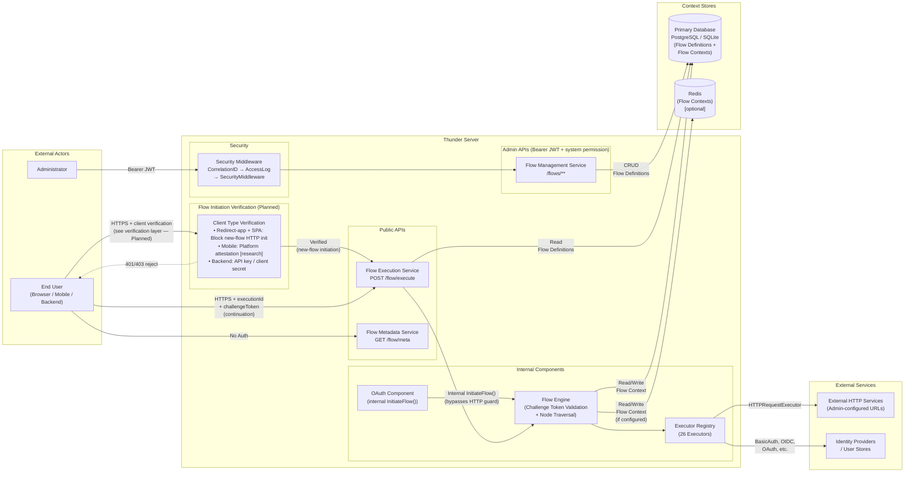
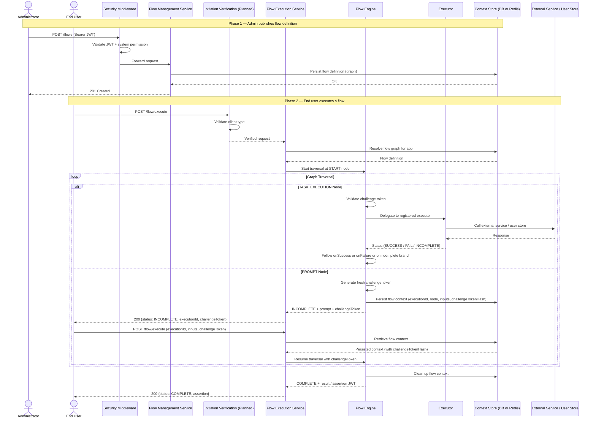
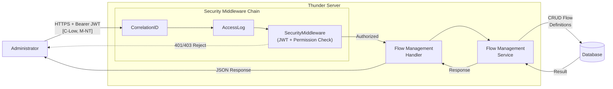
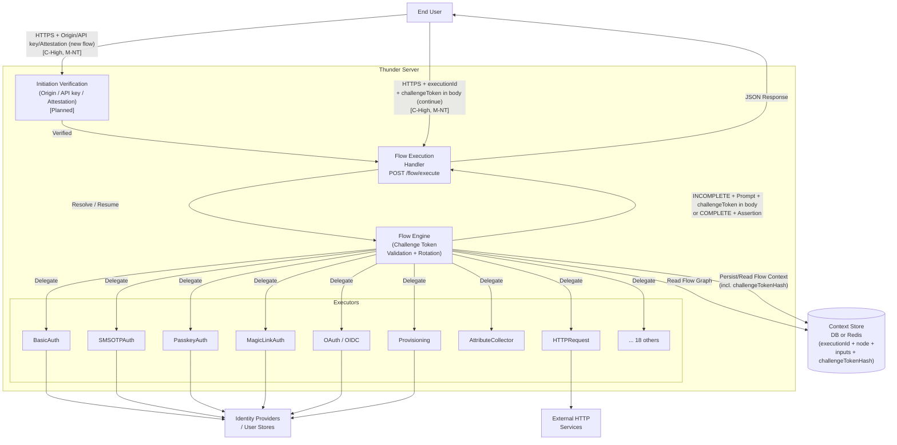
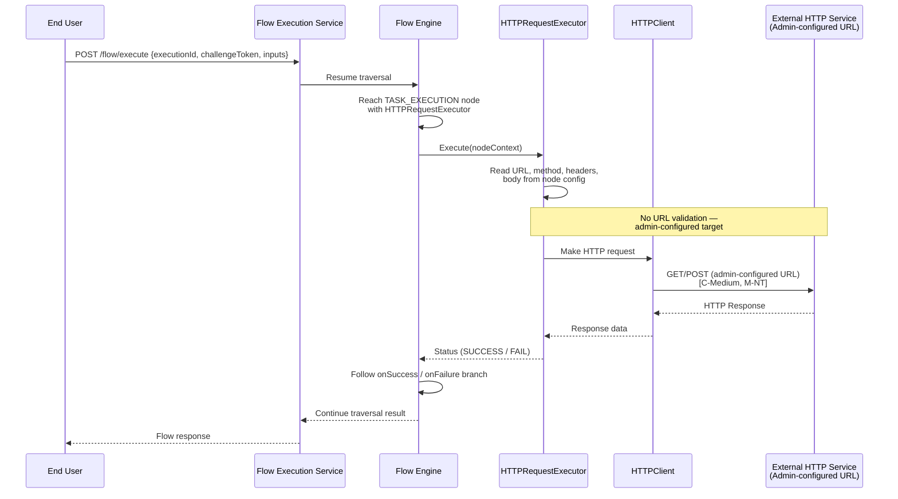

**Thunder Flow Execution**

Threat Model

**Version: v1**  
**Date:** 2026-06-05  
**Email: security@wso2.com**

# **Table of Contents**

[**Revision History**](#revision-history)

[**Introduction**](#introduction)

[Architecture Diagram](#architecture-diagram)

[Data Flow or Sequence Diagram](#data-flow-or-sequence-diagram)

[**Actors and Resources**](#actors-and-resources)

[**Trust Boundaries**](#trust-boundaries)

[**Threats and Mitigations**](#threats-and-mitigations)

[Inherited or Out-of-Scope Risks](#inherited-or-out-of-scope-risks)

[Interactions](#interactions)

[\[01\]: Administrator managing flow definitions](#01-administrator-managing-flow-definitions)

[\[02\]: End user executing a flow](#02-end-user-executing-a-flow)

[\[03\]: Flow engine invoking external HTTP services](#03-flow-engine-invoking-external-http-services)

[**Review Checklist**](#review-checklist)

[Security Considerations](#security-considerations)

[Privacy Considerations](#privacy-considerations)

[**Threat Model Consultation Sessions**](#threat-model-consultation-sessions)

[**Risk Registry Entries**](#risk-registry-entries)

[**Document Lifecycle**](#document-lifecycle)

[**Appendix**](#appendix)

# **Revision History** {#revision-history}

| Version | Release Date | Contributors / Authors | Summary of Changes |
| :---- | :---- | :---- | :---- |
| v1 | 2026-06-05 | [Malith Dilshan](mailto:malithd@wso2.com) | Initial version |

# **Introduction** {#introduction}

Thunder is a lightweight user and identity management server written in Go. A core capability of Thunder is its **flow execution engine** — an orchestratable workflow system that allows administrators to design and publish identity flows such as authentication, registration, user onboarding, and password recovery.

Administrators configure flow definitions through the flow management admin APIs. A flow definition is a directed graph consisting of nodes of the following types:

- **START**: Entry point of a flow.
- **END**: Exit point of a flow.
- **TASK_EXECUTION**: Executes a registered executor (e.g., BasicAuth, SMSOTP, PasskeyAuth, OAuth, OIDC, Provisioning, AttributeCollector, HTTPRequest, etc.). Each task node has `onSuccess`, `onFailure`, and `onIncomplete` branches leading to subsequent nodes.
- **PROMPT**: Collects user input via a client-side prompt with defined input fields.

Once a flow is published, end users interact with the flow execution service via a publicly accessible REST endpoint (`POST /flow/execute`). The engine traverses the graph node-by-node, returning `INCOMPLETE` responses with prompt definitions when user input is needed, and a `COMPLETE` response (potentially including an assertion JWT) upon flow completion. The engine persists flow execution context (execution ID, current node, collected inputs) in the store across interactions.

There are **26 registered executors** including: `BasicAuth`, `SMSOTPAuth`, `PasskeyAuth`, `MagicLinkAuth`, `OAuth`, `OIDCAuth`, `GithubOAuth`, `GoogleOIDC`, `OpenID4VPVerify`, `Identifying`, `AuthAssert`, `Provisioning`, `AttributeCollector`, `Authorization`, `PermissionValidator`, `OU`, `OUResolver`, `HTTPRequest`, `UserTypeResolver`, `Invite`, `Email`, `CredentialSetter`, `Consent`, `AttributeUniquenessValidator`, `SMS`, `FederatedAuthResolver`.

The server enforces a **security middleware chain**: CorrelationID → AccessLog → SecurityMiddleware → Route Handler. Admin endpoints require Bearer JWT authentication with the `system` permission scope. Public endpoints (`/flow/execute`, `/flow/meta`) do not require authentication currently, though a secured-by-default model is planned (see below).

The flow execution service implements a **challenge token** mechanism to bind each step of a multi-step flow to a server-issued per-step token. After each `INCOMPLETE` response, the server generates a fresh cryptographically random 64-character hex token (32 bytes / 256-bit entropy) and returns it to the client. Only a SHA-256 hash of the token is stored server-side in the flow context. The client must include the correct challenge token in every continuation request; validation uses constant-time comparison to prevent timing attacks. A new token is rotated on every successful incomplete step, limiting the exposure window to a single step.

Flow execution contexts have per-flow-type TTLs: **30 minutes** for authentication and recovery flows, **60 minutes** for registration flows, and **24 hours** for user onboarding flows. Expired contexts are excluded from retrieval and subject to cleanup. A proposal to introduce a separate per-challenge-token TTL (15 minutes, sliding window) was evaluated in [design discussion #2744](https://github.com/thunder-id/thunderid/discussions/2744) and the review call concluded that the existing flow-level expiry is sufficient — a separate per-token TTL is not planned.

**Planned: Secured-by-Default Flow Initiation** ([design discussion #2744](https://github.com/thunder-id/thunderid/discussions/2744))

The flow execution service is moving to a **secured-by-default** initiation model. New-flow initiation (`POST /flow/execute` without an `executionId`) will require a valid client-type-specific verification mechanism. Applications will be classified into the following client types:

- **Redirect-based applications, including Browser SPAs** (configured with the `authorization_code` grant type): Direct HTTP new-flow initiation will be **blocked** — these applications must never call the `/flow/execute` HTTP endpoint directly to start a flow. This includes browser-based SPAs, which are explicitly restricted to redirect-based flows following the Identity Server model. Allowing SPAs to call the flow execution endpoint natively is considered an insecure pattern: the `applicationId` is visible in the browser, enabling a malicious application to mimic a legitimate one and perform a man-in-the-middle credential capture. Flows for these clients are initiated exclusively by the OAuth component via an internal `InitiateFlow()` service call (bypasses the HTTP guard). Continuation requests carrying an existing `executionId` remain unaffected. SPA implementation is prioritized. **Note:** An Origin header validation approach was evaluated as an opt-in hardening measure for native SPA flows but was rejected — offering incomplete controls risks encouraging insecure implementation patterns and creates a false sense of security without addressing the fundamental spoofing vulnerability.
- **Mobile clients**: Platform attestation (Apple App Attest on iOS / Google Play Integrity on Android) on the first `/flow/execute` call. Challenge token continues in the response body (acceptable given OS-level process isolation and attestation binding). Mobile attestation is currently **in the research phase**.
- **Backend / server-side clients**: API key or client secret authentication at flow initiation.

## **Architecture Diagram** {#architecture-diagram}



_Diagram 1: Architecture Diagram of Thunder Flow Execution (verification layer is planned, not yet implemented)_

The architecture consists of the following core components:

1. **Flow Management Service** — Admin-facing REST APIs (`/flows/**`) for CRUD operations on flow definitions. Protected by Bearer JWT authentication and the `system` permission scope.
2. **Flow Execution Service** — Public-facing endpoint (`POST /flow/execute`) for end users to initiate and execute flows. Currently unauthenticated; moving to secured-by-default (see above).
3. **Flow Metadata Service** — Public-facing endpoint (`GET /flow/meta`) for retrieving UI rendering metadata for flow executors. No authentication required.
4. **Flow Initiation Verification (Planned)** — Client-type-specific verification gate for new-flow initiation: HTTP guard for redirect-based apps and SPAs (both blocked from direct HTTP initiation), platform attestation for mobile, API key for backend clients.
5. **Flow Engine** — Internal engine that resolves the application's flow graph, traverses nodes, validates challenge tokens, delegates to registered executors, and manages flow execution context.
6. **Primary Database** — Stores flow definitions and, by default, flow execution contexts (PostgreSQL for production, SQLite for development/testing).
7. **Redis (optional)** — An alternative runtime store for flow execution contexts. When configured, flow contexts are stored in Redis instead of the primary database, enabling lower-latency context reads/writes and automatic TTL-based expiry.
8. **Registered Executors** — Pluggable executor implementations that perform specific identity tasks (authentication, provisioning, attribute collection, HTTP requests, etc.).

## **Data Flow or Sequence Diagram** {#data-flow-or-sequence-diagram}



_Diagram 2: Sequence Diagram of Flow Execution Lifecycle_

**Flow Execution Lifecycle:**

1. An administrator creates/publishes a flow definition (a directed graph of nodes) via the admin API (`POST /flows`).
2. An end user initiates a flow by calling `POST /flow/execute` with an `applicationId` and `flowType`. The planned secured-by-default model requires client-type verification at this step (API key for backends, attestation for mobile). Redirect-based applications and SPAs are blocked from direct HTTP initiation — flows for these client types are initiated exclusively by the OAuth component internally.
3. The flow engine resolves the application's flow graph from the store and begins traversal at the START node.
4. For **TASK_EXECUTION** nodes, the engine first validates the challenge token if this is a continuation request (non-empty `executionId`). It then delegates to the registered executor. The executor performs its task (e.g., validates credentials, sends OTP, provisions user) and returns a status (`SUCCESS`, `FAIL`, `INCOMPLETE`). The engine follows the corresponding branch.
5. For **PROMPT** nodes, the engine generates a fresh challenge token (32 bytes of cryptographic randomness), stores the SHA-256 hash in the flow context, and returns an `INCOMPLETE` response with the prompt definition. The challenge token is returned in the response body for all client types (browser SPA, mobile, and backend).
6. The user re-invokes `POST /flow/execute` with the `executionId`, the challenge token (in the request body for all client types), and input data. The engine retrieves the persisted flow context, validates the challenge token, and resumes traversal.
7. Steps 4-6 repeat until an END node is reached. The engine returns a `COMPLETE` response, potentially including an assertion JWT or other completion data.
8. The flow execution context is cleaned up from the store. Flow contexts that are abandoned expire automatically based on per-flow-type TTLs: 30 minutes for authentication and recovery, 60 minutes for registration, and 24 hours for user onboarding.

# **Actors and Resources** {#actors-and-resources}

**Actors**

| Actor (Role) | Description | Roles or Permissions |
| :---- | :---- | :---- |
| End User | End users who interact with identity flows (authentication, registration, password recovery, onboarding) | N/A |
| Malicious User | Malicious users attempting to exploit the flow execution system to gain unauthorized access, enumerate users, or cause service disruption | N/A |
| Admin | Administrators with privileges to create, update, view, and delete flow definitions for the deployment | `system` (internal system permission for flow management API access) |

**Entitlement Matrix**

| Actor | View flow definitions (Admin API) | Create/Update/Delete flow definitions (Admin API) | Initiate flow execution (Public API) | Continue/Complete flow execution (Public API) | View flow metadata (Public API) |
| :---- | :---: | :---: | :---: | :---: | :---: |
| End User | No | No | Yes | Yes | Yes |
| Malicious User | No | No | Yes (if valid origin/key) | No | Yes |
| Admin | Yes | Yes | Yes | Yes | Yes |

**Resources**

| Assets | Description (usage, purpose, Authentication, Authorizations, and Security) |
| :---- | :---- |
| Flow management service | Manage flow definitions (create, read, update, delete) for the deployment. Authentication and authorization are required. Protected with Bearer JWT and the `system` permission scope. REST APIs at `/flows/**`. |
| Flow execution service | Initiate and execute identity flows. Currently unauthenticated; moving to secured-by-default (HTTP block for redirect-based apps and SPAs, API key for backends, attestation for mobile). Browser SPAs must use the `authorization_code` + PKCE redirect-based flow and are blocked from calling this endpoint directly. Flow continuation is bound by the challenge token mechanism. Public endpoint at `POST /flow/execute`. |
| Flow metadata service | Retrieve executor metadata for UI rendering of flow prompts. No authentication or authorization is required. Public endpoint at `GET /flow/meta`. Read-only. |

**Dependencies**

| Dependency | Description (usage, purpose, Authentication, Authorizations, and Security) |
| :---- | :---- |
| Database (PostgreSQL/SQLite) | Stores flow definitions and, by default, flow execution contexts. Internal access only, not externally exposed. Accessed via the `DBClient` internal package. |
| Redis (optional) | When configured, stores flow execution contexts instead of the primary database. Provides TTL-based expiry and lower-latency context operations. Internal access only. |
| External HTTP services | Services invoked by the `HTTPRequestExecutor` during flow execution. URLs are admin-configured in flow definitions. No runtime validation of target URLs. |
| Identity providers / User stores | Internal services accessed by executors (e.g., BasicAuth, OIDC, OAuth) for authentication, user lookups, and provisioning. |
| Apple App Attest / Google Play Integrity (Planned) | External attestation APIs used by the planned mobile attestation verification path. Called by Thunder to verify platform attestation assertions from mobile clients on first flow initiation. |

# **Trust Boundaries** {#trust-boundaries}

This section aims to identify the trust boundaries of the threat model.

| ID | Interaction Type | Interaction |
| :---- | :---- | :---- |
| 1 | Untrust → Trust | A user initiates a flow execution via the public `POST /flow/execute` endpoint. (Planned: mediated by client-type verification gate.) |
| 2 | Untrust → Trust | A user submits input data and challenge token (cookie or body) via a prompt response in flow execution. |
| 3 | Untrust → Trust | Admin accessing Thunder admin APIs over the public network. |
| 4 | Trust → Trust | Admin accessing Thunder admin APIs over an internal/corporate network. |
| 5 | Internal | Flow management service persists flow definitions to the database. |
| 6 | Internal | Flow execution service reads flow definitions from the database. |
| 7 | Internal | Flow execution service persists and reads flow execution contexts from the context store (database or Redis). |
| 8 | Internal | Flow executors accessing internal services (user stores, identity providers) to perform authentication, provisioning, and attribute operations. |
| 9 | Trust → Untrust | Flow engine (`HTTPRequestExecutor`) making HTTP requests to admin-configured external URLs during flow execution. |
| 10 | Trust → Untrust (Planned) | Thunder calling Apple App Attest / Google Play Integrity APIs to verify mobile client attestation assertions on first flow initiation. |

# **Threats and Mitigations** {#threats-and-mitigations}

## **Inherited or Out-of-Scope Risks** {#inherited-or-out-of-scope-risks}

* Email/SMS notifications to end users (e.g., OTP delivery via email or SMS channels).
* Malicious admin or vulnerability allowing configuration of email/SMS services that would lead a malicious entity to intercept MFA emails/SMS.
* Security of individual identity providers (OAuth, OIDC) and their token exchange mechanisms — covered by respective protocol specifications.
* Database-level encryption and access controls — assumed to be managed at the infrastructure layer.
* TLS certificate management and configuration — assumed to be managed at the deployment/infrastructure layer.
* XSS vulnerabilities in client applications consuming the flow execution API — challenge token and assertion JWT security in transit are protected by TLS, but client-side storage and processing are the responsibility of the consuming application.

## **Interactions** {#interactions}

### \[01\]: Administrator managing flow definitions {#01-administrator-managing-flow-definitions}

**Description**

An administrator with the `system` permission manages flow definitions for the deployment via the flow management REST APIs. This includes creating, viewing, updating, and deleting flow definitions (directed graphs of nodes with executors and configurations).

Administrators configure the flow graph structure, assign executors to task nodes, define prompt input fields, set executor-specific properties (e.g., target URLs for `HTTPRequestExecutor`, authentication parameters), configure node-level execution policies (e.g., `AllowSegmentRestart`), and define application-level security properties (e.g., `allowedOrigins` for Origin validation).

**Assets Involved**

| Initiator | Intermediate | Target |
| :---- | :---- | :---- |
| Administrator | | Flow Management Service |

**Data Flow**



_Diagram 3: Data flow diagram for administrator managing flow definitions_

The administrator authenticates via Bearer JWT and invokes REST APIs at `/flows/**`. The flow management service validates the JWT token and checks for the `system` permission via the security middleware chain. Upon successful authorization, the service processes the request (create, read, update, or delete) and persists changes to the database.

**Access Control**

Users with the `system` permission can access the flow management APIs. The security middleware chain validates Bearer JWT tokens and enforces permission checks before routing requests to handlers.

**Security Considerations**

| Area | Response | Comments |
| :---- | :---- | :---- |
| Data Confidentiality | Low confidential \[C-Low\] | The administrator configuring flow definitions does not transmit highly confidential data. Flow definitions describe the structure and configuration of identity flows, not user credentials. However, executor properties may contain sensitive configuration (e.g., API keys for `HTTPRequestExecutor`), and application security properties (e.g., `allowedOrigins`) are security-sensitive. |
| Communication Medium | Network interaction \[M-NT\] | |
| Transport Security | **TLS Encryption** | |
| Authentication | **Bearer Authentication** | Bearer JWT validated by the security middleware chain. |
| Accessibility | **Publicly Accessible / Limited endpoints** | Deployment-dependent. Recommended to restrict admin API access to internal/corporate networks. |

**Threat Assessment**

| ID | Category | Threat | Materializable | Mitigations / Comment |
| :---- | :---- | :---- | :---- | :---- |
| 1 | Denial of Service | DoS/DDoS attack against the flow management API. | No | Authentication is required, limiting the attack surface. Deployments are advised to apply rate limits for admin APIs and restrict network access. |
| 2 | Tampering | Unauthorized modification of flow definitions. | No | Bearer JWT authentication and `system` permission are required. Only authorized administrators can create or modify flow definitions. |
| 3 | Repudiation | Administrator denying that they modified a flow definition. | To Check | Audit logs containing the initiator ID should be published when flow definitions are created, updated, or deleted. Verify that audit log implementation captures sufficient information including the old and new flow definition states. |
| 4 | Elevation of Privilege | `THUNDER_SKIP_SECURITY` environment variable disables all authentication when set to `"true"`. | Yes | If this variable is accidentally set in a production environment, all admin endpoints become unprotected, allowing unauthenticated access to flow management APIs. This should be restricted to development/testing environments only, with safeguards to prevent production use. |
| 5 | Tampering | Insufficient validation of flow node definitions. | Yes | Node `meta` fields and `properties` maps are stored "as-is" without comprehensive validation (noted as a TODO in the codebase). Malicious or invalid configurations could be persisted, potentially leading to unexpected behavior during flow execution. Input validation for flow definitions should be strengthened. |
| 6 | Tampering / Elevation of Privilege | Administrator misconfigures node execution policies (e.g., `AllowSegmentRestart`) on nodes that do not require segment restart capability. | To Check | The `AllowSegmentRestart` execution policy, when set on a node, allows the engine to bypass challenge token validation for that execution step. This policy is currently only intended for the `InviteExecutor` in verify mode. Verify that no other executor or node definition sets this policy without a security justification, and document approved usages. |
| 7 | Tampering | Administrator misconfigures a browser SPA application type, enabling native flow execution instead of enforcing the redirect-based model. | To Check | Browser SPAs must be restricted to the `authorization_code` grant type, which enforces redirect-based flow initiation. If the application type or grant type configuration can be set in a way that bypasses this restriction, the protection is undermined. Origin header validation was evaluated as a hardening option but rejected. Verify that the implementation strictly blocks direct `/flow/execute` initiation for all applications configured with the `authorization_code` grant type, including SPAs. |

### \[02\]: End user executing a flow {#02-end-user-executing-a-flow}

**Description**

End users who need to authenticate, register, recover passwords, or complete other identity flows interact with the flow execution service via the public `POST /flow/execute` endpoint.

The flow execution lifecycle involves: (1) initiating a flow with an `applicationId` and `flowType`, (2) the engine resolving the application's flow graph and beginning traversal, (3) receiving a challenge token and prompt with each `INCOMPLETE` response, (4) responding to prompts with the challenge token and input data (credentials, OTPs, user attributes), and (5) receiving a completion result (assertion JWT, success status).

The execution ID (UUIDv7) serves as the flow session identifier. The challenge token provides per-step binding to prevent unauthorized flow continuation. Flow initiation is moving to a secured-by-default model with client-type-specific verification. Browser SPAs are explicitly restricted to redirect-based flows — direct invocation of `/flow/execute` by SPAs is considered an insecure pattern and will be blocked.

**Client Types and Challenge Token Transport**

| Client Type | Initiation Verification (Planned) | Status |
| :---- | :---- | :---- |
| Redirect-based app + Browser SPA (authorization_code) | HTTP new-flow initiation blocked; SPAs must use redirect-based flow; OAuth component calls InitiateFlow() internally | Planned (SPA prioritized) |
| Mobile client | Platform attestation (App Attest / Play Integrity) | In research |
| Backend / server-side client | API key or client secret | Planned |

**Challenge Token Mechanism**

The challenge token provides a second factor of session binding on top of the execution ID:

- After each `INCOMPLETE` response, the server generates a fresh 32-byte cryptographically random token (`crypto/rand`), returns it to the client in the response body, and stores only the SHA-256 hash server-side.
- On every continuation request, the client must include the challenge token. The engine computes `SHA-256(incomingToken)` and compares it (using `subtle.ConstantTimeCompare`) against the stored hash.
- If validation fails, the engine returns error `FES-1009` ("Invalid challenge token") and **preserves** the flow context (allowing a legitimate retry without losing flow state).
- On a successful step that returns `INCOMPLETE`, the token is rotated — a new token replaces the old one in the store.

**Assets Involved**

| Initiator | Intermediate | Target |
| :---- | :---- | :---- |
| End User | Flow Initiation Verification (Planned) | Flow Execution Service |

**Data Flow**



_Diagram 4: Data flow diagram for end user executing a flow_

**Access Control**

The flow execution service is moving from an open endpoint to a secured-by-default model. New-flow initiation will require client-type-specific verification. Flow continuation is gated by the challenge token — knowledge of only the `executionId` is insufficient to continue a flow. Both redirect-based applications and browser SPAs will have their HTTP new-flow initiation path blocked — flows for these client types are exclusively initiated by the OAuth component internally via `InitiateFlow()`. SPAs must use the authorization_code + PKCE redirect-based flow, following the established Identity Server model. Direct SPA access to the flow execution endpoint is not supported as it exposes the application to spoofing and man-in-the-middle credential capture attacks.

**Security Considerations**

| Area | Response | Comments |
| :---- | :---- | :---- |
| Data Confidentiality | High confidential \[C-High\] | A flow execution can involve users sending credentials (passwords, OTPs, passkeys) and personal attributes over network calls. Assertion JWTs containing user information may also be returned. |
| Communication Medium | Network interaction \[M-NT\] | |
| Transport Security | **TLS Encryption** | |
| Authentication | **Planned: client-type verification at initiation** | Currently unauthenticated. Moving to: HTTP block for redirect-based apps and SPAs (must use OAuth redirect flow), API key for backend, attestation for mobile. Challenge token provides per-step session binding (not user authentication). |
| Accessibility | **Publicly Accessible** (currently); **Secured-by-default** (planned) | |

**Threat Assessment**

| ID | Category | Threat | Materializable | Mitigations / Comment |
| :---- | :---- | :---- | :---- | :---- |
| 1 | Denial of Service | DoS attack against the `POST /flow/execute` endpoint. | Yes | Currently: no rate limiting or bot detection on the open endpoint — attackers can flood with requests causing resource exhaustion. The planned secured-by-default model will partially mitigate this by requiring valid Origins/API keys for new-flow initiation, reducing the anonymous attack surface. Continuation requests still require a valid challenge token. Rate limiting and bot detection should still be implemented. Customers are advised to apply infrastructure-level rate limits. |
| 3 | Spoofing | Execution ID (UUIDv7) session hijacking — attacker continues another user's flow using only the execution ID. | No | The challenge token mechanism mitigates this threat. Even if an attacker obtains the `executionId`, they cannot continue the flow without the challenge token from the most recent `INCOMPLETE` response. The challenge token is a 32-byte cryptographically random value (256-bit entropy), generated fresh for every step, with only its SHA-256 hash stored server-side. An attacker would need to intercept the token in transit (HTTPS mitigates this) or compromise the client environment to obtain it. |
| 4 | Denial of Service | Flow context accumulation — abandoned flow contexts exhausting store resources. | No | Flow execution contexts have per-flow-type TTLs enforced at the store layer: authentication and recovery flows expire in 30 minutes, registration flows in 60 minutes, and user onboarding flows in 24 hours. The `EXPIRY_TIME` column is checked on context retrieval (`EXPIRY_TIME > now`), and Redis-backed deployments benefit from native TTL-based eviction. |
| 5 | Information Disclosure | Sensitive data (passwords, OTPs) temporarily in memory during flow execution. | No | `PASSWORD_INPUT` and `OTP_INPUT` values are cleared from the node context after executor processing in authentication flows. These values exist briefly in memory during processing but are not persisted beyond the executor's lifecycle. |
| 6 | Security Risk | Administrator configures a flow without adequate MFA, allowing malicious users to complete flows without proper verification. | No | Administrators must configure flows with at least one strong authentication factor before allowing sensitive operations (e.g., password reset, account provisioning). This is a deployment-level responsibility. |
| 7 | Information Disclosure / Spoofing | Challenge token exposed via XSS or insecure client-side storage in consuming browser applications. | Yes | The challenge token is returned in the JSON response body for all client types including browser SPAs. A successful XSS attack in a consuming application can extract it. Consuming browser applications must implement strict CSP, avoid persisting the token in `localStorage` or `sessionStorage`, and treat the challenge token as sensitive as the assertion JWT. For mobile/backend clients, the response body is acceptable given OS-level process isolation and attestation binding. |
| 8 | Spoofing / Elevation of Privilege | Segment restart policy (`AllowSegmentRestart`) bypasses challenge token validation — attacker re-enters a flow segment using only the execution ID. | To Check | The `AllowSegmentRestart` execution policy, when active on a node response, causes the engine to skip challenge token validation for the next request. This policy is currently only set by the `InviteExecutor` in verify mode. If an attacker knows the `executionId` of a flow at such a node, they can potentially re-enter the segment without a challenge token. Verify that invitation flow execution IDs are not guessable or exposed. Assess whether additional binding (e.g., the invite code itself) provides sufficient protection when challenge token validation is bypassed. |
| 9 | Cross-Site Request Forgery (CSRF) | CSRF attack against browser SPA clients calling `/flow/execute` directly. | No | Browser SPAs are restricted to redirect-based flows and cannot call `/flow/execute` directly. The CSRF vector against a native SPA flow is eliminated by design. For redirect-based flows, PKCE binding and the OAuth `state` parameter provide CSRF protection at the authorization layer. |
| 10 | Spoofing / Man-in-the-Middle | A malicious application mimicking a legitimate SPA to capture user credentials by proxying the real backend flow. | No | This was the primary threat driving the decision to restrict SPAs to redirect-based flows. In a native SPA flow the `applicationId` is visible in the browser, allowing an attacker to build a lookalike application that initiates a real flow against the backend and relays credentials entered by the victim. By restricting SPAs to the `authorization_code` + PKCE redirect model, the IDP enforces redirection to pre-registered `redirect_uri` values only — the attacker cannot complete the authorization code exchange without controlling a registered redirect URI. Origin header validation was evaluated as a partial mitigation for this threat but was **rejected** — it provides an incomplete control that could create a false sense of security without addressing the fundamental spoofing vulnerability. |
| 11 | Tampering / Elevation of Privilege | Redirect-based app and SPA HTTP guard placed at the wrong code layer, blocking the OAuth component's internal `InitiateFlow()` path or failing to block HTTP-initiated new flows. | To Check | The HTTP guard for redirect-based apps and SPAs (`authorization_code` grant) must be placed in `loadNewContext()` in the flow execution service, not in `initContext()`. Placement in `initContext()` would block the OAuth component's internal `InitiateFlow()` service call, breaking Gate. Placement only in the HTTP handler level without checking within the service would allow bypass via future code paths. Verify correct placement. |

### \[03\]: Flow engine invoking external HTTP services {#03-flow-engine-invoking-external-http-services}

**Description**

The `HTTPRequestExecutor` is a registered executor that allows flow nodes to make HTTP requests (GET or POST) to admin-configured external URLs during flow execution. This enables integration with external services as part of identity flows (e.g., calling a webhook, validating data with an external API).

The target URL, HTTP method, headers, and body are configured by the administrator as part of the flow definition. During flow execution, the engine invokes the `HTTPRequestExecutor`, which makes the HTTP request and processes the response.

**Assets Involved**

| Initiator | Intermediate | Target |
| :---- | :---- | :---- |
| Flow Execution Service | | External HTTP Service |

**Data Flow**



_Diagram 5: Data flow diagram for flow engine invoking external HTTP services_

1. During flow execution, the engine reaches a TASK_EXECUTION node configured with the `HTTPRequestExecutor`.
2. The executor reads the target URL, method, headers, and body from the flow node configuration (admin-configured).
3. The executor makes an HTTP GET/POST request to the configured URL using the internal `HTTPClient`.
4. The response from the external service is processed and the executor returns a status to the engine.

**Access Control**

The target URLs and HTTP request parameters are configured by the administrator at flow definition time. There is no runtime validation or restriction on the target URLs — the administrator has full control over what URLs are invoked. The security of this interaction depends on:

1. The administrator configuring only trusted, intended URLs.
2. Network-level controls to restrict outbound requests from the Thunder server.

**Security Considerations**

| Area | Response | Comments |
| :---- | :---- | :---- |
| Data Confidentiality | Medium confidential \[C-Medium\] | The request may include user data or flow context data sent to external services. The response may contain sensitive data from external services. |
| Communication Medium | Network interaction \[M-NT\] | |
| Transport Security | **TLS Encryption recommended** | The administrator should configure HTTPS URLs. No enforcement of TLS at the executor level. |
| Authentication | **Admin-configured** | Authentication to the external service is configured by the administrator (e.g., API keys in headers). No built-in mutual authentication. |
| Accessibility | **Trust → Untrust** | The flow engine (trusted) makes requests to external services (untrusted). |

**Threat Assessment**

| ID | Category | Threat | Materializable | Mitigations / Comment |
| :---- | :---- | :---- | :---- | :---- |
| 1 | Tampering / Elevation of Privilege | Server-Side Request Forgery (SSRF) via `HTTPRequestExecutor`. | Yes | Admin-configured URLs could target internal services (e.g., `http://localhost:...`, `http://internal-service:...`), allowing the flow execution service to make unauthorized requests to internal infrastructure. No URL allowlist/denylist validation is implemented. A URL validation mechanism should be added to restrict target URLs to approved external domains, and internal/private IP ranges should be blocked. |
| 2 | Information Disclosure | Sensitive data exposure from internal services via SSRF. | Yes | If an SSRF vulnerability is exploited (threat #1), responses from internal services could expose sensitive data (configuration, credentials, internal state) to the flow execution context, which may be visible in flow responses. Mitigated by addressing threat #1. |
| 3 | Denial of Service | External service unavailability causing flow execution delays or failures. | No | Server-level timeouts are configured (ReadHeaderTimeout: 10s, WriteTimeout: 10s, IdleTimeout: 120s). The `HTTPClient` should implement appropriate request timeouts. Customers should monitor external service availability. The delegation of security assessment to the customer for these external service endpoints is reasonable since they are admin-configured. |

# **Review Checklist** {#review-checklist}

## **Security Considerations** {#security-considerations}

| Security Consideration | State | Comments |
| :---- | :---- | :---- |
| Are all inputs and outputs validated? | Partial | The flow execution handler sanitizes all incoming request fields (`SanitizeString`, `SanitizeStringMap`) before processing. User inputs from flow prompts are validated per-executor via `validateInputValues` in `internal/flow/core/input_validation.go`, enforcing `MinLength`, `MaxLength`, and `Regex` rules. Flow definition structure (format, name, flow type, UUID format, minimum node count) is validated in `mgt/service.go`. However, node-level property schemas and `meta` fields within flow definitions are not validated beyond what individual executors parse — executor configs are stored as-is. |
| Are rate limits in place where necessary? | No | No rate limiting or bot detection is present anywhere in the codebase. No rate-limiter package is imported, and no middleware applies request throttling on `POST /flow/execute` or admin APIs. |
| Are proper authentication and authorizations in place before granting access to resources based on least privilege and business needs? | Partial | Admin APIs require Bearer JWT + `system` permission, enforced by the security middleware (`internal/system/security/service.go`, `jwt_authenticator.go`). `POST /flow/execute` is listed in `publicPaths` and is currently exempt from authentication. Client-type-specific initiation verification (HTTP block for redirect-based apps and SPAs, API key for backends, attestation for mobile) is planned but not yet implemented. Origin header validation for SPA native flows was evaluated and rejected — SPAs are restricted to redirect-based flows by design. |
| Are permissions, roles, and entitlements defined (based on least privilege) and validated in both the front end and back end? | Yes | The `system` permission scope is validated by the backend security middleware (`internal/system/security/permissions.go`). `HasSufficientPermission` uses hierarchical prefix matching and fails closed if permissions are not initialised. Flow execution does not require permissions by design. |
| Have any default credentials been changed, and are the default superuser/root accounts not in use? | To Check | The environment variable `SKIP_SECURITY` (not `THUNDER_SKIP_SECURITY`) disables authentication enforcement when set to `"true"`. When active, requests that fail authentication on non-public paths are allowed through with a warning banner logged. Additionally, authorization checks in `internal/system/sysauthz/service.go` short-circuit to allow-all when security is skipped. Verify that `SKIP_SECURITY` is not set in any production deployment. |
| Is the source code kept private? | No | Thunder is an open-source product licensed under Apache 2.0. |
| Is the source code or IaC code review being conducted, and have the findings been addressed? | Yes | Will be covered from the product scan. |
| Is Static/IaC scanning conducted on the source code, and are findings addressed? | Yes | Will be covered from the product scan. |
| Is Software Composition Analysis being conducted or integrated into the source code repository, and are findings addressed? (Examples include FOSSA, JFrog XRay, or Trivy) | Yes | Will be covered from the product scan. |
| Is Dynamic scanning conducted on the non-production setup, and are findings addressed? | Yes | Will be covered from the product scan. |
| Are audit logs generated for critical functionalities and made available to administrators to track critical events? | Partial | Flow execution events are comprehensively published via the observability service: `FLOW_STARTED`, `FLOW_COMPLETED`, `FLOW_FAILED`, `FLOW_NODE_EXECUTION_STARTED`, `FLOW_NODE_EXECUTION_COMPLETED`, `FLOW_NODE_EXECUTION_FAILED` (all in `engine.go`). However, flow definition CRUD operations (create, update, delete in `mgt/service.go`) are only logged via `logger.Debug/Error` — no structured audit events (`FlowCreated`, `FlowUpdated`, `FlowDeleted`) are published. |
| Do audit logs for critical configuration changes include a record of the differences between the old and new versions? | To Check | Structured audit events for flow definition updates are not yet implemented (see above). Verify whether the previous version is retained in the database and whether a diff can be reconstructed when the audit logging gap is addressed. |
| What aspects of resilience are considered, such as RPO/RTO, MTTD, high availability, backups, disaster recovery options, health check endpoints, and end-user messaging? | To Check | Thunder provides a health check endpoint. Verify backup/DR strategies for the database containing flow definitions and execution contexts. If Redis is used as the context store, ensure its high-availability and persistence configuration aligns with recovery objectives. |
| Are data in transit and data at rest encrypted? | Partial | TLS is configurable (`cmd/server/main.go`, minimum TLS 1.2+) but **optional** — if not configured the server starts in plain HTTP. Flow execution contexts are AES-GCM encrypted before being stored (`encryptEngineContext` in `service.go`). Challenge tokens are stored as SHA-256 hashes, never plaintext. `PASSWORD_INPUT` and `OTP_INPUT` are cleared from the node context after executor processing (`clearSensitiveInputs` in `engine.go`), but only for `FlowTypeAuthentication` flows — these inputs in Registration or Recovery flows are not cleared after use. |
| Are sensitive data, such as credentials and keys, stored in secret stores like key vaults? | No | Custom HTTP headers (including `Authorization` headers) configured in `HTTPRequestExecutor` nodes are stored as part of the flow definition JSON in the database — effectively **plaintext in the flow definition**. No dedicated secrets manager or encrypted-at-definition-time mechanism exists for executor configs. |
| Have you ensured that personal, sensitive, or confidential data is not logged in the logs? | Partial | `log.MaskedString` / `log.MaskedStrings` is used across several executors (e.g., user IDs in `identifying_executor.go`, OTP recipients in `sms_auth_executor.go`, client IDs in OAuth flows). Challenge tokens are not directly logged by any observed log statement. However, there is no explicit assertion that `PASSWORD_INPUT` or `OTP_INPUT` values from `UserInputs` are masked if they appear in debug-level log paths. |
| Is the challenge token mechanism correctly implemented and free from bypass vectors? | Yes | `crypto/rand` is used for token generation (`GenerateSecureToken`). `subtle.ConstantTimeCompare` is used for hash validation (`ValidateTokenHash`). Tokens are stored as SHA-256 hashes. Validation is enforced on every continuation request in `validateChallengeToken` (`engine.go`), skipped only for the first request (when `ChallengeTokenHash` is empty) or when `ExecutionPolicy.SkipChallengeValidation` is true. `AllowSegmentRestart` and `SkipChallengeValidation` are currently only set by the `InviteExecutor` (`invite_executor.go`). Note: these policies are set by executor code with no higher-level allowlist enforcement — verify that no other executor sets these flags. |
| Is the challenge token returned correctly in the response body for all client types (SPA, mobile, backend) and never leaked in error responses or logs? | Yes | The token is returned in the JSON response body field `ChallengeToken` (`flowexec/handler.go`). It is not set as a cookie. Error responses returned by `handleFlowError` do not include a `ChallengeToken` field. No observed log statement logs the raw token. |
| Is the HTTP guard for redirect-based apps and SPAs placed at the correct code layer (in `loadNewContext()`, not `initContext()`) to avoid blocking the OAuth component's internal `InitiateFlow()` path? | No | No HTTP guard for redirect-based or SPA client types is present in either `loadNewContext()` or `initContext()`. The `initContext` function checks flow enablement flags but performs no client-type-based access control. This is a planned control not yet implemented. Origin header validation for native SPA flows was evaluated and **rejected** — SPAs are restricted to redirect-based flows by architectural decision, not by Origin-based hardening. |

## **Vulnerability Management**

| Vulnerability Management | Response | Comments |
| :---- | :---- | :---- |
| How are we planning to address product vulnerabilities, and what's the frequency of patching? | To Check | Verify patching cadence for Thunder server and its Go dependencies. |
| How are we planning to address deployment vulnerabilities, and what's the frequency of patching? | To Check | Verify patching cadence for deployment infrastructure (database, Redis, OS, container images). |
| Are there any **End of Life or End of Service components** being used? | No | Thunder uses Go latest stable version. PostgreSQL, SQLite, and Redis are actively maintained. |

## **Privacy Considerations** {#privacy-considerations}

**This is to be filled out only if the development requires processing of Personal Data**.

| Privacy Consideration | State | Comments |
| :---- | :---- | :---- |
| Is the purpose and legal basis for the processing of personal data clearly defined? | To Check | Flow execution processes personal data (usernames, email addresses, phone numbers, attributes). Verify that purpose and legal basis are defined. |
| Is personal data being stored securely? | To Check | Flow execution contexts containing user inputs are stored in the context store (database or Redis). Verify encryption at rest and proper access controls for both store types. |
| Are privacy policies updated to reflect any new personal data processing or changes to purpose and legal basis? | To Check | |
| Is access to personal data being granted based on the need to know? | Yes | Flow execution data is scoped to the specific flow instance. Admin APIs are protected by authentication and authorization. |
| Are data retention requirements considered? | Yes | Flow execution contexts have per-flow-type TTLs: 30 minutes (authentication/recovery), 60 minutes (registration), 24 hours (user onboarding). These should be reviewed against data retention policies to ensure they are appropriate. |
| Is there a process for disposing of personal data collected upon request in a timely manner while meeting retention requirements? | To Check | Verify whether flow execution contexts containing personal data can be purged on request before their TTL expires. |
| Have you added relevant records in "[WSO2 Data Inventory](https://docs.google.com/spreadsheets/d/1kGVhgvaAi1XYtflf5I_r6bcZQqdimRmm2VXf221FbKY/edit?gid=986734575#gid=986734575)" or [\[Cloud\] Data Storages](https://docs.google.com/spreadsheets/d/1TFajRmy3YLuYkZxNyJOkSuE9orjFcuHLmLWxvT1HWnY/edit?gid=224115104#gid=224115104) (for clouds) related to the processing of personal data? | To Check | |

# **Threat Model Consultation Sessions** {#threat-model-consultation-sessions}

Session 1:

* Date: TBD
* Participants:
* Session recording: \[LINK\]
* Notes:
  *
* Action Items:
- [ ]

Session 2:

* Date: TBD
* Participants:
* Session recording: \[LINK\]
* Notes:
  *
* Action Items:
- [ ]

# **Risk Registry Entries** {#risk-registry-entries}

The following threats were assessed as materializable and require risk registry entries with tracking GitHub issues:

**Active risks:**

- [ ] \[01\]-4: `THUNDER_SKIP_SECURITY` environment variable can disable all authentication in production.
- [ ] \[01\]-5: Insufficient validation of flow node definitions (meta fields and properties stored "as-is").
- [ ] \[01\]-6: Administrator misconfiguration of `AllowSegmentRestart` execution policy on non-approved nodes.
- [ ] \[01\]-7: Administrator misconfiguration of application type allows SPA to bypass redirect-based flow restriction and call `/flow/execute` directly.
- [ ] \[02\]-1: No rate limiting or bot detection on the `POST /flow/execute` endpoint (partially mitigated by planned secured-by-default model).
- [ ] \[02\]-7: Challenge token is in the response body for all client types including browser SPAs — consuming browser apps must implement strict CSP and avoid persisting the token in persistent storage.
- [ ] \[02\]-8: Segment restart (`AllowSegmentRestart`) bypass of challenge token validation in invitation flows.
- [ ] \[02\]-11: HTTP guard for redirect-based apps and SPAs (`authorization_code` grant) must be implemented in `loadNewContext()` to block direct `/flow/execute` initiation while preserving the OAuth component's internal `InitiateFlow()` path.
- [ ] \[03\]-1: SSRF via `HTTPRequestExecutor` — no URL allowlist/denylist for admin-configured target URLs.
- [ ] \[03\]-2: Sensitive data exposure from internal services via SSRF.

**Previously materializable threats now mitigated:**

- ~~\[02\]-3~~: Flow ID session hijacking — **mitigated** by the challenge token mechanism (per-step cryptographic token binding, 256-bit entropy, constant-time validation).
- ~~\[02\]-4~~: No TTL/expiry on flow execution contexts — **mitigated** by per-flow-type TTL implementation (30 min / 60 min / 24 h depending on flow type).

# **Document Lifecycle** {#document-lifecycle}

- [ ] The threat model moved to [Security Review Documents](https://drive.google.com/drive/folders/1xKJ0HfPaufYSouC_Rma7S2z3fKUPQega)
- [ ] Threat model reviewed by security team and leads
- [ ] Created GitHub issues for tracking threats that need to be addressed
- [ ] Risk registry entities updated with [Asela Jayatilleke](mailto:aselaj@wso2.com) (if applicable)

# **Appendix** {#appendix}

### Feature/Product Documentation:

* [Thunder README](/README.md)
* [Thunder Backend README](/backend/README.md)
* [Design Discussion #2744 — Client verification enhancement for app-native flows](https://github.com/thunder-id/thunderid/discussions/2744)

### CNAD/Application Development Checklist:

N/A

### Sample Configs:

A typical authentication flow definition (simplified):

```json
{
  "flowId": "auth-flow-01",
  "name": "Basic Authentication Flow",
  "nodes": [
    {
      "id": "start",
      "type": "START",
      "next": "prompt-credentials"
    },
    {
      "id": "prompt-credentials",
      "type": "PROMPT",
      "meta": {
        "title": "Sign In",
        "inputs": [
          { "name": "USERNAME_INPUT", "type": "text", "required": true },
          { "name": "PASSWORD_INPUT", "type": "password", "required": true }
        ]
      },
      "next": "basic-auth"
    },
    {
      "id": "basic-auth",
      "type": "TASK_EXECUTION",
      "executorName": "BasicAuth",
      "onSuccess": "end-success",
      "onFailure": "end-failure",
      "onIncomplete": "prompt-credentials"
    },
    {
      "id": "end-success",
      "type": "END",
      "properties": { "status": "SUCCESS" }
    },
    {
      "id": "end-failure",
      "type": "END",
      "properties": { "status": "FAILURE" }
    }
  ]
}
```

### Sample Flow Execution API Exchange (with Challenge Token):

**Step 1 — Initiate a new flow (browser SPA with Origin header):**

```
POST /flow/execute
Origin: https://app.example.com
Content-Type: application/json

{
  "applicationId": "app-001",
  "flowType": "AUTHENTICATION"
}
```

Response (`INCOMPLETE` — prompt returned, challenge token in response body):
```
HTTP/1.1 200 OK
Content-Type: application/json

{
  "executionId": "019500ab-1234-7abc-def0-000000000001",
  "flowStatus": "INCOMPLETE",
  "challengeToken": "a3f8c2e1...64hexchars",
  "type": "VIEW",
  "data": {
    "inputs": [
      { "name": "USERNAME_INPUT", "type": "text", "required": true },
      { "name": "PASSWORD_INPUT", "type": "password", "required": true }
    ]
  }
}
```

**Step 2 — Continue with credentials (browser SPA includes challenge token in request body):**

```
POST /flow/execute
Origin: https://app.example.com
Content-Type: application/json

{
  "executionId": "019500ab-1234-7abc-def0-000000000001",
  "challengeToken": "a3f8c2e1...64hexchars",
  "inputs": {
    "USERNAME_INPUT": "alice@example.com",
    "PASSWORD_INPUT": "s3cur3p@ss"
  }
}
```

Response (`COMPLETE` — assertion returned):
```json
{
  "executionId": "019500ab-1234-7abc-def0-000000000001",
  "flowStatus": "COMPLETE",
  "assertion": "eyJhbGciOiJSUzI1NiIsInR5cCI6IkpXVCJ9..."
}
```

### Sample Audit Logs:

```
[INFO] 2025-09-22T10:30:00Z correlationId=abc-123 action=FLOW_DEFINITION_CREATED initiator=admin@wso2.com flowId=auth-flow-01 flowName="Basic Authentication Flow"
[INFO] 2025-09-22T11:00:00Z correlationId=def-456 action=FLOW_DEFINITION_UPDATED initiator=admin@wso2.com flowId=auth-flow-01 flowName="Basic Authentication Flow"
[INFO] 2025-09-22T14:00:00Z correlationId=ghi-789 action=FLOW_DEFINITION_DELETED initiator=admin@wso2.com flowId=auth-flow-01
```

> **Note:** The above are illustrative examples. Verify actual audit log format and content in the codebase to ensure sufficient detail is captured.

### Key Source Files Referenced:

| Package | Key Files | Purpose |
| :---- | :---- | :---- |
| `internal/flow/flowexec` | `init.go`, `handler.go`, `service.go`, `engine.go`, `model.go`, `store.go`, `redis_store.go`, `error_constants.go` | Flow execution engine, public endpoint handler, flow context persistence (DB + Redis), challenge token validation and rotation, error codes |
| `internal/flow/mgt` | `init.go`, `handler.go`, `service.go` | Flow management admin APIs |
| `internal/flow/core` | `graph.go`, `node.go`, `executor.go`, `model.go` | Core domain primitives (graph, node types, executor interface, ExecutionPolicy) |
| `internal/flow/executor` | `init.go`, `registry.go`, `constants.go` | Executor registration, lookup, and name constants (26 registered executors) |
| `internal/security` | `permissions.go`, `service.go`, `middleware.go` | Security middleware chain, JWT validation, permission enforcement |
| `internal/system/cryptolib` | `token.go` | Challenge token generation (`GenerateToken`), hashing (`HashToken`), and validation (`ValidateTokenHash`) using `crypto/rand` and `crypto/sha256` |
| `api/` | `flow-execution.yaml` | OpenAPI 3.0 specification including `challengeToken`, `executionId`, `flowType` schema definitions |
