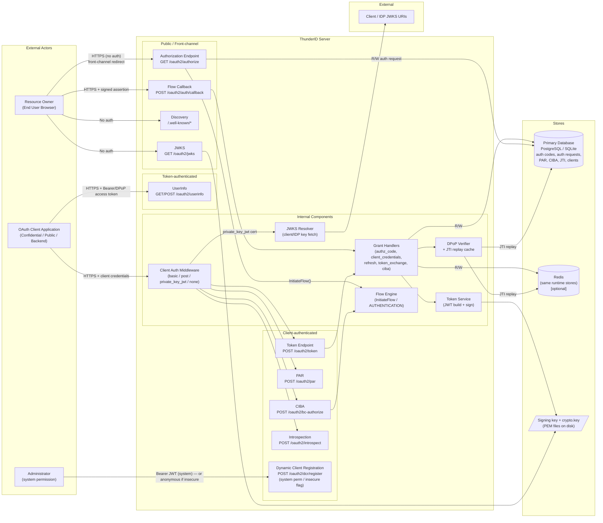
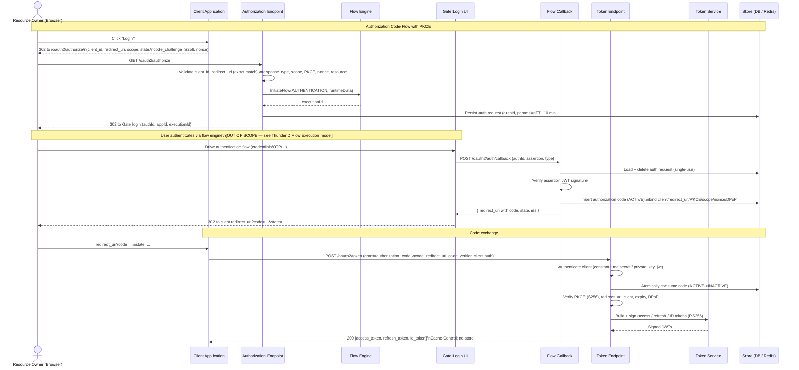
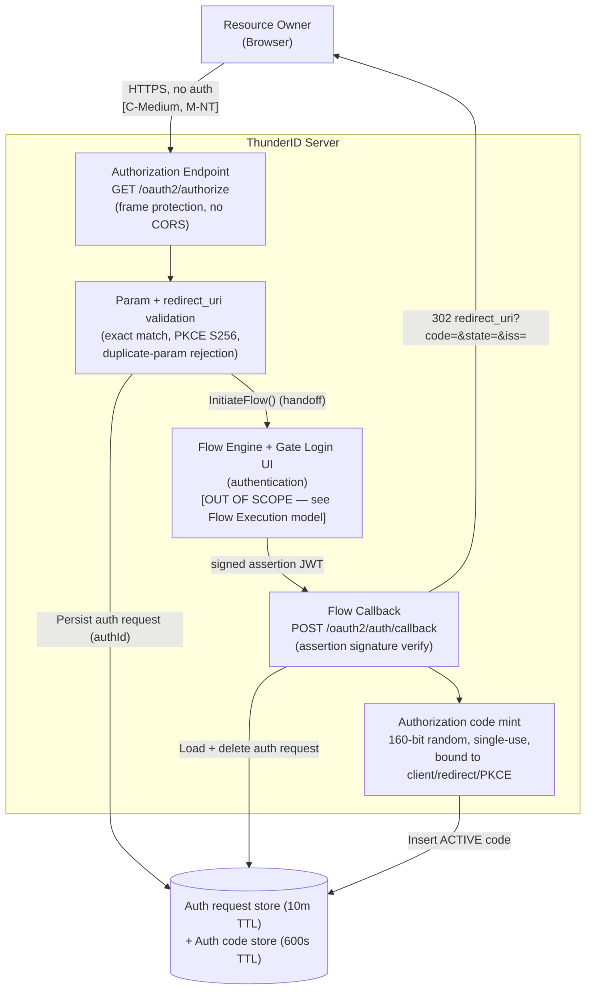
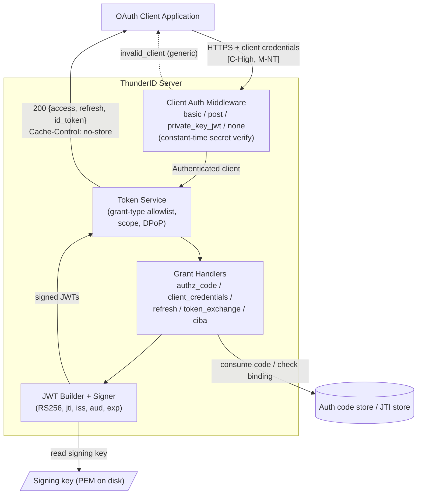
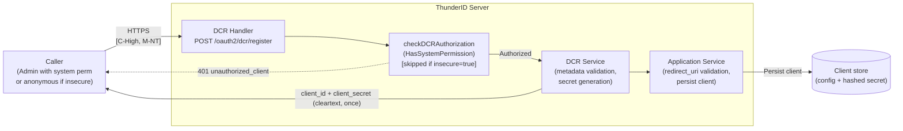
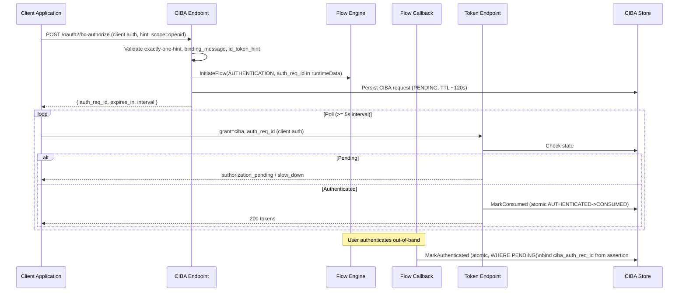

**ThunderID OAuth2 & OpenID Connect**

Threat Model

**Version: v1**  
**Date:** 2026-06-17  
**Email: security@wso2.com**

# **Table of Contents**

[**Revision History**](#revision-history)

[**Introduction**](#introduction)

[Architecture Diagram](#architecture-diagram)

[Data Flow or Sequence Diagram](#data-flow-or-sequence-diagram)

[**Actors and Resources**](#actors-and-resources)

[**Trust Boundaries**](#trust-boundaries)

[**Threats and Mitigations**](#threats-and-mitigations)

[Inherited or Out-of-Scope Risks](#inherited-or-out-of-scope-risks)

[Interactions](#interactions)

[\[01\]: User authorization request and authorization code issuance](#01-user-authorization-request-and-authorization-code-issuance)

[\[02\]: Client token issuance at the token endpoint](#02-client-token-issuance-at-the-token-endpoint)

[\[03\]: Dynamic Client Registration](#03-dynamic-client-registration)

[\[04\]: CIBA backchannel authentication](#04-ciba-backchannel-authentication)

[\[05\]: Pushed Authorization Requests (PAR)](#05-pushed-authorization-requests-par)

[\[06\]: Token introspection and UserInfo](#06-token-introspection-and-userinfo)

[\[07\]: Public OIDC metadata and JWKS](#07-public-oidc-metadata-and-jwks)

[**Review Checklist**](#review-checklist)

[Security Considerations](#security-considerations)

[Privacy Considerations](#privacy-considerations)

[**Threat Model Consultation Sessions**](#threat-model-consultation-sessions)

[**Risk Registry Entries**](#risk-registry-entries)

[**Document Lifecycle**](#document-lifecycle)

[**Appendix**](#appendix)

# **Revision History** {#revision-history}

| Version | Release Date | Contributors / Authors | Summary of Changes |
| :---- | :---- | :---- | :---- |
| v1 | 2026-06-17 | [Malith Dilshan](mailto:malithd@wso2.com) | Initial version |

# **Introduction** {#introduction}

ThunderID is a lightweight user and identity management server written in Go. This threat model covers its **OAuth 2.0 / OpenID Connect (OIDC) component** — the set of protocol endpoints that issue, validate, and describe OAuth tokens, and that act as the standards-compliant front door through which client applications obtain access, refresh, and ID tokens, whether on their own behalf or on behalf of an authenticated end user (resource owner).

**Supported grant types.** ThunderID is not limited to the interactive browser flow. The token endpoint (`POST /oauth2/token`) supports the following grants, and the threats in this model apply across all of them:

- **`authorization_code`** (with PKCE) — interactive user authorization via the front-channel; the only grant that drives an end-user login.
- **`client_credentials`** — machine-to-machine; the token subject is the application itself, with scopes gated by RBAC.
- **`refresh_token`** — exchanges a refresh token for a fresh access/ID token; rotation is configurable and off by default.
- **`urn:ietf:params:oauth:grant-type:token-exchange`** (RFC 8693) — exchanges a subject token for a new token (delegation/impersonation).
- **`urn:openid:params:grant-type:ciba`** — completes a CIBA backchannel request (poll mode).

Only `authorization_code` and CIBA involve the authentication flow engine; the others are pure back-channel, client-authenticated exchanges. The implicit grant is not supported (response type is restricted to `code`).

For the `authorization_code` and CIBA grants, ThunderID does not authenticate the user at the OAuth layer itself — the authorization endpoint delegates to an internal authentication flow (via the flow engine's `InitiateFlow()` API) and consumes the resulting signed **assertion JWT** as a trust input to mint an authorization code. This model focuses on the OAuth/OIDC protocol surface — client authentication, grant processing, token issuance and validation, sender-constraining, and the OAuth-specific stores. The authentication flow itself is covered by the companion *ThunderID Flow Execution* threat model.

The component implements the following protocol surface:

- **Authorization endpoint** (`GET /oauth2/authorize`) — front-channel entry point for the `authorization_code` flow. Public.
- **Flow callback** (`POST /oauth2/auth/callback`) — verifies the flow assertion and issues an authorization code. Public.
- **Token endpoint** (`POST /oauth2/token`) — issues access, refresh, and ID tokens for all supported grants. Client-authenticated.
- **CIBA backchannel** (`POST /oauth2/bc-authorize`, poll mode) — client-authenticated.
- **Pushed Authorization Requests** (`POST /oauth2/par`, RFC 9126) — single-use `request_uri`. Client-authenticated.
- **Dynamic Client Registration** (`POST /oauth2/dcr/register`, RFC 7591) — `system` permission by default; anonymous if `oauth.dcr.insecure`.
- **Token introspection** (`POST /oauth2/introspect`, RFC 7662) — client-authenticated.
- **UserInfo** (`GET`/`POST /oauth2/userinfo`) — access-token (bearer/DPoP) authenticated.
- **Discovery & JWKS** (`/.well-known/*`, `GET /oauth2/jwks`) — public metadata and public signing keys.

**Token model.** Access, refresh, and ID tokens are **stateless signed JWTs** (default RS256, signing key loaded from a PEM file on disk). They are **not persisted server-side**, so there is currently no revocation mechanism — tokens are valid until their natural expiry (defaults: access 3600 s, refresh 86400 s, authorization code 600 s). A direct consequence is **stale authorization**: when a user's roles, permissions, or scopes are changed (or the user is suspended/deleted, or a client secret is regenerated), already-issued tokens continue to carry the *old* privileges until they expire — the change does not take effect for outstanding tokens. Token revocation is an in-progress design ([discussion #3321](https://github.com/thunder-id/thunderid/discussions/3321)), which proposes a server-side blocklist (JTI-based single-token revocation plus criteria-based bulk revocation covering client deletion, user lifecycle events, and permission/scope changes, with push notifications to resource servers). Until that lands, deployments should keep token TTLs short. DPoP (RFC 9449) sender-constraining is supported and binds tokens to a client-held key via the `cnf.jkt` claim.

**Sender-constraining and proof-of-possession.** PKCE is S256-only (the `plain` method is rejected) and is forced for all public clients. DPoP proofs are fully validated (signature, `htm`/`htu`/`iat`/`jti`/`ath`) with a server-side JTI replay cache. PAR `request_uri` values carry 256-bit entropy and are single-use and client-bound.

**Cross-cutting security posture.** All `/oauth2/**` and `/.well-known/*` paths are in the global security middleware's public allowlist, so the platform-wide authenticated-principal middleware does **not** gate these endpoints. Each endpoint enforces its own scheme (client authentication, bearer/DPoP token, or intentionally anonymous). This means there is no defense-in-depth from the global layer for OAuth endpoints — endpoint-level controls are the only line of defense. As with the rest of the product, there is currently no rate limiting anywhere.

## **Architecture Diagram** {#architecture-diagram}



_Diagram 1: Architecture Diagram of the ThunderID OAuth2 / OIDC component_

The architecture consists of the following core components:

1. **Authorization Endpoint** — front-channel `GET /oauth2/authorize`. Validates the client and request parameters, enforces PKCE for public clients, resolves PAR `request_uri` values, and initiates an authentication flow. Wrapped with frame-protection headers (`X-Frame-Options: DENY`, `frame-ancestors 'none'`); CORS is intentionally disabled on this route.
2. **Flow Callback** — `POST /oauth2/auth/callback`. Receives the signed assertion from the Gate UI when a flow completes, verifies its signature, and issues an authorization code or completes a CIBA request.
3. **Token Endpoint** — `POST /oauth2/token`. Runs client authentication (middleware), then grant-type-specific validation, scope handling, DPoP proof verification, and token issuance. Sets `Cache-Control: no-store`.
4. **Client Authentication Middleware** — supports `client_secret_basic`, `client_secret_post`, `private_key_jwt`, and `none` (public clients). Each client is restricted to a single allowlisted method. Secrets are verified against salted hashes with constant-time comparison.
5. **Grant Handlers** — `authorization_code`, `client_credentials`, `refresh_token`, `token_exchange`, and `ciba`. Each enforces its own binding and validation rules.
6. **Token Service** — builds and signs JWT access/refresh/ID tokens with the server signing key.
7. **DPoP Verifier + JTI replay cache** — validates DPoP proofs and binds tokens to client keys; the JTI store provides cross-feature replay protection.
8. **Stores** — authorization codes, authorization requests, PAR requests, CIBA requests, JTI records, and client records, persisted in the primary database (PostgreSQL/SQLite) or Redis when configured. Signing and at-rest encryption keys are PEM/key files on disk.
9. **JWKS Resolver** — fetches client/IDP public keys for `private_key_jwt` and token-exchange validation, with SSRF protections and a response size cap.

## **Data Flow or Sequence Diagram** {#data-flow-or-sequence-diagram}



_Diagram 2: Sequence Diagram of the Authorization Code Flow (with PKCE and flow-engine authentication)_

**OAuth Authorization Code Lifecycle** (the `authorization_code` grant is shown as the most complex case; the back-channel grants share steps 5–6):

1. The client application redirects the user's browser to `GET /oauth2/authorize` with `client_id`, `redirect_uri`, `response_type=code`, `scope`, `state`, an S256 `code_challenge`, and (for OIDC) `nonce`.
2. The authorization endpoint looks up the client, validates the `redirect_uri` (exact match by default; bad/unknown clients and invalid redirect URIs are rendered on a server error page and never redirected to an attacker-supplied URL), validates `response_type`/`grant_type`/PKCE/`nonce`/resources, and rejects duplicate query parameters. It then persists the validated request parameters in the **authorization request store** keyed by a server-generated `authId` (10-minute TTL).
3. The endpoint hands off to the authentication flow engine to authenticate the user. **The authentication itself — the flow engine, the Gate login UI, and the steps performed — is out of scope here (see the *ThunderID Flow Execution* model).** From the OAuth component's perspective, the flow eventually returns a **signed assertion JWT** asserting the authenticated subject and authorized permissions.
4. The assertion is delivered to `POST /oauth2/auth/callback`. The callback loads and deletes the auth request (single-use), **verifies the assertion signature**, optionally enforces the `sub` claim constraint, sets the granted permission scopes from the assertion's `authorized_permissions`, mints a 160-bit random authorization code bound to the client/redirect_uri/PKCE/scope/nonce/DPoP, persists it as `ACTIVE`, and returns the client redirect URI carrying `code`, `state`, and `iss`.
5. The client exchanges its grant at `POST /oauth2/token`. **Client authentication runs first** (for all grants). For `authorization_code`, the code is **atomically consumed** (`ACTIVE → INACTIVE`); a replay finds zero rows affected and is rejected. PKCE (`code_verifier` against the stored S256 challenge), `redirect_uri`, `client_id`, expiry, and DPoP binding are re-validated. Other grants run their own validation (RBAC for `client_credentials`, refresh-token signature + scope-subset for `refresh_token`, subject-token verification for `token_exchange`, request state for `ciba`).
6. The token service builds and signs the access token (`at+jwt`), optional refresh token, and ID token, each with `jti`, `iss`, `aud`, `exp`, `iat`, `nbf` and the DPoP `cnf.jkt` where applicable. Tokens are returned with `Cache-Control: no-store`. **No token is persisted; revocation before expiry is not possible.**

# **Actors and Resources** {#actors-and-resources}

**Actors**

| Actor (Role) | Description | Roles or Permissions |
| :---- | :---- | :---- |
| Resource Owner (End User) | End users who authenticate through the OAuth front-channel to grant client applications access to their identity and resources | N/A |
| OAuth Client Application | Confidential, public (PKCE), or backend/machine clients registered with ThunderID that request tokens on their own or a user's behalf | Per-client grant types, scopes, redirect URIs, auth method |
| Malicious User / Client | An attacker attempting to steal authorization codes/tokens, register rogue clients, replay proofs, enumerate clients/tokens, or cause service disruption | N/A |
| Administrator | Operators who register/configure OAuth clients and the server (signing keys, DCR mode, issuer) | `system` (root system permission) |

**Entitlement Matrix**

| Actor | Initiate /oauth2/authorize | Exchange code / obtain token | Register client (DCR) | Introspect a token | Call UserInfo | Read discovery / JWKS |
| :---- | :---: | :---: | :---: | :---: | :---: | :---: |
| Resource Owner | Yes | No | No | No | No | Yes |
| OAuth Client Application | Yes (initiates for user) | Yes (own grants) | Yes (if `system` perm, or anyone if `insecure`) | Yes (any registered/authenticated client) | Yes (with valid access token) | Yes |
| Malicious User / Client | Yes (public endpoint) | Only with stolen/valid credentials | Only if `insecure=true` or `system` perm obtained | Only with a valid client_id (incl. public `none` client) | Only with a valid access token | Yes |
| Administrator | Yes | Yes | Yes | Yes | Yes | Yes |

**Resources**

| Assets | Description (usage, purpose, Authentication, Authorizations, and Security) |
| :---- | :---- |
| Authorization endpoint | Front-channel initiation of the `authorization_code` flow. Public (no client auth); identity is established by the downstream authentication flow. Frame-protection headers set; CORS disabled. `GET /oauth2/authorize`. |
| Flow callback | Receives the signed assertion and issues authorization codes / completes CIBA. Public; trust is established by verifying the assertion JWT signature. `POST /oauth2/auth/callback`. |
| Token endpoint | Issues access/refresh/ID tokens for all supported grant types. Client-authenticated (basic/post/private_key_jwt/none). `POST /oauth2/token`. |
| CIBA backchannel endpoint | Client-Initiated Backchannel Authentication (poll mode). Client-authenticated; CIBA grant must be allowlisted per client. `POST /oauth2/bc-authorize`. |
| PAR endpoint | Accepts pushed authorization parameters, returns a single-use 256-bit `request_uri`. Client-authenticated. `POST /oauth2/par`. |
| DCR endpoint | Registers OAuth clients. Authenticated by default (root `system` permission); anonymous when `oauth.dcr.insecure=true`. `POST /oauth2/dcr/register`. |
| Introspection endpoint | Reports token active state and metadata. Client-authenticated. `POST /oauth2/introspect`. |
| UserInfo endpoint | Returns OIDC claims gated by scope and per-app allowlist. Bearer- or DPoP-authenticated. `GET`/`POST /oauth2/userinfo`. |
| Discovery & JWKS | Public OIDC/AS metadata and public signing keys. No authentication. `/.well-known/*`, `GET /oauth2/jwks`. |

**Dependencies**

| Dependency | Description (usage, purpose, Authentication, Authorizations, and Security) |
| :---- | :---- |
| Flow Engine | Internal authentication engine invoked via `InitiateFlow()` for `AUTHENTICATION` flows triggered by `/oauth2/authorize` and CIBA. Returns a signed assertion JWT on completion. Covered by the *ThunderID Flow Execution* threat model. |
| Database (PostgreSQL/SQLite) | Stores OAuth client records (non-secret config), authorization codes, authorization requests, PAR requests, CIBA requests, and JTI replay records. Internal access only. |
| Redis (optional) | Alternative runtime store for the same OAuth runtime artifacts (auth codes, PAR, CIBA, JTI), providing native TTL eviction and atomic Lua-script operations. Internal access only. |
| Signing key / crypto key files | The JWT signing private key and the AES-GCM at-rest master key are PEM/key files on disk under `ServerHome`. No HSM/KMS integration. Security depends on filesystem permissions. |
| Client / IDP JWKS endpoints | External JWKS URIs fetched by the JWKS resolver to validate `private_key_jwt` client assertions and token-exchange subject tokens. SSRF-protected, response size capped at 1 MB. |
| Credential store (ENTITY) | Client secrets are stored salted-hashed (SHA256/PBKDF2/Argon2id) in `ENTITY.SYSTEM_CREDENTIALS`, verified with constant-time comparison. |

# **Trust Boundaries** {#trust-boundaries}

This section aims to identify the trust boundaries of the threat model.

| ID | Interaction Type | Interaction |
| :---- | :---- | :---- |
| 1 | Untrust → Trust | Resource owner's browser hits the public `GET /oauth2/authorize` front-channel endpoint. |
| 2 | Untrust → Trust | Gate UI / browser POSTs a signed assertion to the public `POST /oauth2/auth/callback`. |
| 3 | Untrust → Trust | Client application calls `POST /oauth2/token` with client credentials and a grant. |
| 4 | Untrust → Trust | Client application calls `POST /oauth2/par` (client-authenticated) to push authorization parameters. |
| 5 | Untrust → Trust | Client calls `POST /oauth2/bc-authorize` and polls `POST /oauth2/token` for a CIBA grant. |
| 6 | Untrust → Trust | A caller registers an OAuth client via `POST /oauth2/dcr/register`. |
| 7 | Untrust → Trust | A client / resource server calls `POST /oauth2/introspect`. |
| 8 | Untrust → Trust | A client calls `GET`/`POST /oauth2/userinfo` with an access token. |
| 9 | Untrust → Trust | Anonymous fetch of `/.well-known/*` and `GET /oauth2/jwks`. |
| 10 | Internal | The authorization service initiates an authentication flow via the flow engine's `InitiateFlow()`. |
| 11 | Internal | OAuth stores (auth codes, auth requests, PAR, CIBA, JTI) read/write to the database or Redis. |
| 12 | Internal | Client-secret verification against the ENTITY credential store (salted-hash, constant-time). |
| 13 | Trust → Untrust | The JWKS resolver fetches client/IDP JWKS URIs to validate assertions and subject tokens. |
| 14 | Internal | The token service reads the signing private key from disk to sign issued JWTs. |

# **Threats and Mitigations** {#threats-and-mitigations}

## **Inherited or Out-of-Scope Risks** {#inherited-or-out-of-scope-risks}

* Security of the authentication flow itself (credential validation, MFA, federated IdP token exchange) — covered by the *ThunderID Flow Execution* threat model.
* Client-side storage and handling of issued tokens (e.g., XSS in the client application extracting an access token from browser storage) — the responsibility of the consuming application. Transport is protected by TLS.
* Security of external identity providers and their token endpoints used during token exchange / federation — covered by the respective protocol specifications.
* Database-level and Redis-level encryption and access controls — assumed to be managed at the infrastructure layer.
* TLS certificate management and configuration — assumed to be managed at the deployment/infrastructure layer.
* Filesystem-level protection of the signing key and AES master key files — assumed to be managed at the deployment/OS layer.
* Resource-server (API) enforcement of the scopes/audiences embedded in issued access tokens — the responsibility of the protected resource consuming the token.

## **Interactions** {#interactions}

### \[01\]: User authorization request and authorization code issuance {#01-user-authorization-request-and-authorization-code-issuance}

**Description**

A resource owner's browser is redirected by a client application to `GET /oauth2/authorize`. The endpoint validates the client and request parameters, initiates an authentication flow through the flow engine, and redirects the browser to the Gate login UI. After the user authenticates, the Gate UI POSTs the resulting signed assertion to `POST /oauth2/auth/callback`, which verifies the assertion and issues a single-use authorization code on the client's `redirect_uri`.

**Assets Involved**

| Initiator | Intermediate | Target |
| :---- | :---- | :---- |
| Resource Owner (Browser) | Flow Engine / Gate Login UI | Authorization Endpoint + Flow Callback |

**Data Flow**



_Diagram 3: Data flow diagram for authorization request and code issuance_

**Access Control**

The authorization endpoint is public (no client authentication) — it is the browser redirect target. Trust in the resulting code is established by (a) validating the client and an exact-match `redirect_uri` before any redirect can occur, (b) authenticating the user through the flow engine, and (c) verifying the signature of the assertion JWT at the callback before minting a code. The authorization code is single-use, 160-bit random, short-lived (600 s default), and bound to the client, redirect URI, PKCE challenge, scope, nonce, and DPoP key.

**Security Considerations**

| Area | Response | Comments |
| :---- | :---- | :---- |
| Data Confidentiality | Medium confidential \[C-Medium\] | The front-channel carries no credentials, but the authorization code and `state` traverse the browser and the redirect URI. The assertion JWT carries user identity claims. |
| Communication Medium | Network interaction \[M-NT\] | |
| Transport Security | **TLS Encryption** | A `http` redirect URI triggers an insecure-warning flag but is not blocked. |
| Authentication | **Flow-engine authentication + assertion signature** | The endpoint itself is unauthenticated; user identity is established by the flow and proven by a signed assertion. |
| Accessibility | **Publicly Accessible** | |

**Threat Assessment**

| ID | Category | Threat | Materializable | Mitigations / Comment |
| :---- | :---- | :---- | :---- | :---- |
| 1 | Spoofing / Open Redirect | Attacker supplies a malicious `redirect_uri` to steal the authorization code. | No | `redirect_uri` is validated against registered URIs (exact-match by default; wildcard matching is opt-in and constrained to single DNS labels with `..` path cleaning and fragment rejection). Invalid/unknown clients and bad redirect URIs render a server error page and are never redirected to the attacker URL — open-redirect-safe ordering. |
| 2 | Spoofing / Code Interception | Authorization code intercepted and replayed by an attacker (e.g., on a public client). | No | PKCE is forced for all public clients and is S256-only (`plain` rejected, challenge format strictly validated). The code is bound to the PKCE challenge, client, and redirect URI, all re-verified at the token endpoint. |
| 3 | Replay | Authorization code replayed for a second token issuance. | No | The code is consumed atomically (`ACTIVE → INACTIVE` via SQL conditional UPDATE / Redis Lua CAS); a replay finds zero rows affected and is rejected. 160-bit `crypto/rand` entropy; 600 s TTL. |
| 4 | Replay / Elevation of Privilege | On detecting a replayed code, already-issued tokens are not revoked. | Yes | RFC 6749 §10.5 recommends revoking all tokens derived from a replayed code. An explicit in-code TODO acknowledges this is not implemented. Compounded by stateless tokens (no revocation capability — see \[02\]). The in-progress revocation design ([#3321](https://github.com/thunder-id/thunderid/discussions/3321)) calls out auth-code replay as a single-token (JTI-based) revocation trigger and would resolve this once landed. |
| 5 | Tampering | Forged or tampered assertion presented at the callback to mint a code for an arbitrary user. | No | The assertion JWT signature is verified before a code is issued; an empty userID is rejected; the `sub` claim constraint is enforced for OIDC requests. |
| 6 | Tampering | Assertion verified with empty issuer/audience arguments — potential cross-context assertion replay. | To Check | The callback verifies the assertion signature but passes empty `expectedIss`/`expectedAud`. Verify in the JWT service whether empty arguments skip issuer/audience validation; if so, any server-signed JWT could be accepted as a flow assertion. Needs confirmation in the JWT verifier. |
| 7 | Information Disclosure | Authorization code or assertion leaked via logs. | No | The code and assertion content are never logged; only `authId` (debug) and `client_id` (not secret) appear in logs. |
| 8 | CSRF | Cross-site request forgery against the authorization request. | No | `state` is faithfully round-tripped (the client's CSRF token); `iss` is returned for RFC 9207 mix-up defense. For redirect-based flows, PKCE + `state` provide CSRF protection at the authorization layer. |
| 9 | Clickjacking | The authorization/login surface framed by a malicious site. | No | `/oauth2/authorize` sets `X-Frame-Options: DENY` and CSP `frame-ancestors 'none'`; CORS is disabled on the endpoint. |
| 10 | Denial of Service | Flood of `/oauth2/authorize` requests creating flow contexts and auth-request rows. | Yes | No rate limiting anywhere in the product. Each request initiates a flow and persists an auth-request row (10 min TTL). Rate limiting / bot detection should be applied at the infrastructure layer. |
| 11 | Tampering | Parameter pollution via duplicated query parameters. | No | All query parameters except `resource` (RFC 8707, repeatable) are rejected if duplicated. |
| 12 | Spoofing | Consent is not enforced — a code is issued without explicit user consent. | To Check | The consent path is an unimplemented TODO; `prompt=consent` returns `consent_required`. No user consent step currently gates code issuance. Confirm whether consent is a product requirement. |

### \[02\]: Client token issuance at the token endpoint {#02-client-token-issuance-at-the-token-endpoint}

**Description**

Client applications exchange grants for tokens at `POST /oauth2/token`. Client authentication runs as middleware before the handler. The endpoint supports `authorization_code`, `client_credentials`, `refresh_token`, `token_exchange` (RFC 8693), and `ciba` grants. Access, refresh, and ID tokens are stateless signed JWTs.

**Assets Involved**

| Initiator | Intermediate | Target |
| :---- | :---- | :---- |
| OAuth Client Application | Client Auth Middleware / Grant Handlers | Token Endpoint + Token Service |

**Data Flow**



_Diagram 4: Data flow diagram for token issuance_

**Access Control**

Clients authenticate via a single allowlisted method (`client_secret_basic`, `client_secret_post`, `private_key_jwt`, or `none` for public clients). The grant type must be allowlisted per client. Client secrets are stored salted-hashed and verified with constant-time comparison; `private_key_jwt` assertions are verified against the client's registered certificate/JWKS with the token endpoint URL enforced as the audience. Authentication failures return a generic `invalid_client` with no distinction between unknown client and wrong secret.

**Security Considerations**

| Area | Response | Comments |
| :---- | :---- | :---- |
| Data Confidentiality | High confidential \[C-High\] | Client credentials, authorization codes, refresh tokens, and the issued access/ID tokens are all high-value secrets transiting this endpoint. |
| Communication Medium | Network interaction \[M-NT\] | |
| Transport Security | **TLS Encryption** | |
| Authentication | **Client authentication (4 methods)** | Per-client single allowlisted method; constant-time secret verification. |
| Accessibility | **Publicly Accessible** | |

**Threat Assessment**

| ID | Category | Threat | Materializable | Mitigations / Comment |
| :---- | :---- | :---- | :---- | :---- |
| 1 | Spoofing | Brute-force / credential-stuffing of client secrets. | Yes | Secrets are 256-bit `crypto/rand` and verified in constant time, but there is no rate limiting or lockout on failed client authentication. Apply infrastructure-level throttling. |
| 2 | Information Disclosure | Client/token enumeration via differential error responses. | No | All client-auth failures return a generic `invalid_client`. (Minor: a not-found client computes no hash, a theoretical low-severity timing oracle — see Review Checklist.) |
| 3 | Tampering | Algorithm-confusion / `alg:none` attack on token verification. | No | The verifier rejects `alg:none`; only asymmetric algorithms are in the allowlist and there is no HMAC path, so RSA↔HMAC confusion is not exploitable. |
| 4 | Elevation of Privilege | Client requests scopes beyond what it is authorized for. | To Check | The generic scope validator (`scope.ValidateScopes`) is a **no-op** (returns requested scopes unchanged), so there is no per-client *registered-scope allowlist* enforcement. In practice each grant constrains scopes contextually: `authorization_code` binds scopes at authorize time (overwritten from the assertion's `authorized_permissions`); `client_credentials` gates via RBAC (`EvaluateAccessBatch`); `refresh_token` enforces subset-of-original-grant; `token_exchange` filters to the subject token's scopes; all paths downscope against Resource Server definitions. The residual gap is the absent generic allowlist (defense-in-depth). Confirm no grant path allows an unregistered scope to reach an issued token. Tracking issue to be created. |
| 5 | Replay / Token Theft | Stolen refresh token replayed to mint new access tokens. | Yes | Refresh tokens are stateless JWTs with no server-side store, no reuse/replay detection, and rotation is off by default (`renew_on_grant=false`). A leaked refresh token is valid until natural expiry (24 h default). Consider enabling rotation and adding reuse detection. Tracking issue to be created. |
| 6 | Repudiation / Token Theft | No revocation of issued access or refresh tokens before expiry. | Yes | Tokens are stateless JWTs not persisted anywhere; there is no revocation list, no revocation on logout, and no admin revocation. Compromised tokens (or tokens belonging to a deleted/suspended user or deregistered client) remain valid until `exp`. Token revocation is an in-progress design ([#3321](https://github.com/thunder-id/thunderid/discussions/3321)) proposing a JTI blocklist plus criteria-based bulk revocation. Until then, keep TTLs short. |
| 7 | Elevation of Privilege | Stale authorization — a token issued before a role/permission/scope change retains the old privileges until expiry. | Yes | Because authorization decisions are frozen into the JWT at issuance and there is no revocation, updating a user's roles/permissions (or withdrawing a scope) does **not** affect outstanding access tokens; the user keeps elevated access for up to the access-token lifetime (1 h default), and refresh tokens can re-mint tokens carrying the old grant for up to 24 h. This is an explicit driver of the revocation design ([#3321](https://github.com/thunder-id/thunderid/discussions/3321), "permission changes — role removal, scope withdrawal"). Mitigation today: short TTLs and disabling/rotating the refresh token out of band. |
| 8 | Spoofing | Token bound to one client used by another (token/refresh confusion). | No | Refresh tokens bind `sub == client_id`; authorization codes bind `client_id` and re-check at exchange. Token-exchange validates subject-token issuer and audience. |
| 9 | Tampering | Sender-constrained (DPoP) access token replayed by a different party. | No | When DPoP is configured and the client is DPoP-bound, the proof is fully validated (signature, `htm`/`htu`/`iat`/`jti`/`ath`) and the token's `cnf.jkt` is enforced. A server-side JTI replay cache prevents proof reuse. |
| 10 | Information Disclosure | Sensitive material leaked via logs or error responses. | No | `client_id` is masked in logs; secrets are never logged. Error responses return only `{error, error_description}`; `server_error` detail is replaced with a generic message and DPoP errors are collapsed to a generic message. |
| 11 | Tampering | DPoP not enforced — token issued without sender-constraining when expected. | To Check | DPoP is not required globally (`dpop.required=false` default) and relies on per-client `DPoPBoundAccessTokens`. CIBA-issued tokens are never DPoP-bound even for DPoP clients (see \[04\]). Confirm per-client DPoP enforcement matches policy. |
| 12 | Tampering | Compromise of the signing key forging arbitrary tokens. | Partial | The signing private key is an unencrypted PEM file on disk (no HSM/KMS). Anyone with filesystem read access can forge tokens. The default key is a build-time self-signed RSA-2048 cert (CN=localhost) and **must** be replaced for production. Filesystem protection is a deployment responsibility. |
| 13 | Elevation of Privilege | Token exchange (RFC 8693) used to escalate privilege or impersonate via a forged/borrowed subject token. | No | `ValidateSubjectToken` verifies the subject token against the self issuer (server key) or a configured external IdP's JWKS; for external tokens the server's issuer must be in the token's `aud`, and token exchange must be explicitly enabled on the IdP. Issued scopes are filtered to a subset of the subject token's scopes; subject-token DPoP `cnf.jkt` binding is enforced. The `act` (actor) claim records the delegation chain. |
| 14 | Spoofing | Stolen access token (bearer) replayed by an attacker. | Partial | Bearer access tokens are not sender-constrained unless the client is DPoP-bound. For high-value clients, enable `dpop_bound_access_tokens` so tokens carry `cnf.jkt` and require a matching proof at the resource. Otherwise mitigation relies on TLS and short token TTLs. |

### \[03\]: Dynamic Client Registration {#03-dynamic-client-registration}

**Description**

`POST /oauth2/dcr/register` (RFC 7591) registers OAuth clients. By default it requires the root `system` permission; setting `oauth.dcr.insecure=true` removes all authentication and allows anonymous registration.

**Assets Involved**

| Initiator | Intermediate | Target |
| :---- | :---- | :---- |
| Administrator / Caller | DCR Authorization Check | DCR Service + Application Store |

**Data Flow**



_Diagram 5: Data flow diagram for Dynamic Client Registration_

**Access Control**

When `oauth.dcr.insecure=false` (the default), the handler requires the caller to hold the root `system` permission (validated via a bearer JWT, since `/oauth2/**` is a public path the global middleware does not block it — but anonymous callers get empty permissions and are rejected with 401). When `insecure=true`, the authorization check is skipped entirely and anyone can register a client.

**Security Considerations**

| Area | Response | Comments |
| :---- | :---- | :---- |
| Data Confidentiality | High confidential \[C-High\] | The generated `client_secret` is returned in cleartext (once) in the response. |
| Communication Medium | Network interaction \[M-NT\] | |
| Transport Security | **TLS Encryption** | |
| Authentication | **Root `system` permission (default) / none (insecure)** | Governed by the `oauth.dcr.insecure` flag. |
| Accessibility | **Publicly reachable path; authorization-gated by default** | |

**Threat Assessment**

| ID | Category | Threat | Materializable | Mitigations / Comment |
| :---- | :---- | :---- | :---- | :---- |
| 1 | Elevation of Privilege | Anonymous open client registration when `oauth.dcr.insecure=true`. | Yes | With the flag enabled, anyone can register clients (choosing grant types, redirect URIs, DPoP binding) with no rate limiting, no software statement, and no initial access token. The flag defaults to `false` (secure). Document that it must never be enabled in production. Tracking issue to be created. |
| 2 | Tampering | Rogue client registered with an attacker-controlled redirect URI. | No (default) / Yes (insecure) | Redirect URIs are validated by the application service (full qualification, fragment rejection). Under secure mode only `system`-permission holders can register; under insecure mode this becomes an open phishing/token-theft vector. |
| 3 | Spoofing | `none` (public) clients created at will, then used to introspect tokens. | Yes | DCR can create public (`none`-auth) clients, which forces PKCE — but a public client with a valid `client_id` can still authenticate to the introspection endpoint (see \[06\]). Compounded under insecure mode. |
| 4 | Information Disclosure | Client secrets never expire (`client_secret_expires_at: 0`). | Yes | Generated secrets are 256-bit and returned once in cleartext, but never expire and there is no RFC 7592 client-configuration endpoint or registration access token to rotate/revoke them. Mild hygiene concern; consider secret lifetimes. |
| 5 | Elevation of Privilege | All anonymously/DCR-registered clients land in the root OU. | To Check | An in-code TODO notes `ou_id` defaults to the first root OU for DCR apps. Verify the OU/tenant placement is appropriate and does not over-privilege registered clients. |
| 6 | Denial of Service | Registration flooding exhausts client storage. | Yes | No rate limiting on registration. Under insecure mode this is unauthenticated. Apply infrastructure throttling and keep DCR secured. |

### \[04\]: CIBA backchannel authentication {#04-ciba-backchannel-authentication}

**Description**

`POST /oauth2/bc-authorize` initiates a Client-Initiated Backchannel Authentication request (poll mode). The client is authenticated and must have the CIBA grant allowlisted. The user is identified from a hint and authenticated out-of-band via a flow; the client polls `POST /oauth2/token` with the `auth_req_id` until authentication completes.

**Assets Involved**

| Initiator | Intermediate | Target |
| :---- | :---- | :---- |
| OAuth Client Application | Flow Engine (out-of-band auth) | CIBA Service + Token Endpoint |

**Data Flow**



_Diagram 6: Sequence diagram for CIBA backchannel authentication (poll mode)_

**Access Control**

The bc-authorize endpoint is client-authenticated and requires the CIBA grant to be allowlisted per client. The `auth_req_id` is bound to the authenticated client at the token endpoint. The callback binds the assertion to the specific request via a `ciba_auth_req_id` claim and uses atomic state transitions to prevent double-callback and double-consume races.

**Security Considerations**

| Area | Response | Comments |
| :---- | :---- | :---- |
| Data Confidentiality | High confidential \[C-High\] | The flow authenticates a user and issues tokens delivered to the polling client. |
| Communication Medium | Network interaction \[M-NT\] | |
| Transport Security | **TLS Encryption** | |
| Authentication | **Client authentication + assertion signature** | bc-authorize and token polling are client-authenticated; the callback verifies the assertion signature. |
| Accessibility | **Publicly Accessible (client-authenticated)** | |

**Threat Assessment**

| ID | Category | Threat | Materializable | Mitigations / Comment |
| :---- | :---- | :---- | :---- | :---- |
| 1 | Spoofing | `auth_req_id` guessed by an attacker to retrieve another user's tokens. | No | `auth_req_id` is bound to the authenticated polling client and to the assertion's `ciba_auth_req_id` claim. The polling client must also authenticate. (See ID 2 for the entropy nuance.) |
| 2 | Spoofing | `auth_req_id` has lower entropy than other identifiers (UUIDv7, ~74 random bits, time-ordered). | To Check | Unlike PAR's 256-bit random `request_uri`, CIBA uses UUIDv7. Client binding is the primary mitigation, but consider using a fully-random identifier to match PAR. Tracking issue to be created. |
| 3 | Replay | CIBA request consumed twice to issue duplicate token sets. | No | `MarkConsumed` is an atomic `AUTHENTICATED → CONSUMED` transition (SQL conditional UPDATE / Redis Lua); a concurrent double-poll loses the race and gets `invalid_grant`. |
| 4 | Tampering | A narrow-scope assertion replayed against a broader CIBA request. | No | The callback rejects the assertion unless its `ciba_auth_req_id` claim matches the stored request. |
| 5 | Tampering | CIBA-issued tokens are not DPoP-bound even for DPoP clients. | Yes | `issueTokens` builds the access token with no `cnf.jkt`. CIBA tokens are never sender-constrained. Tracking issue to be created. |
| 6 | Tampering | Audience check on the callback assertion silently skipped on client-lookup failure. | To Check | If the client lookup fails, the callback proceeds without the `aud` defense-in-depth check (signature is still verified). Confirm this path cannot be triggered by an attacker. |
| 7 | Denial of Service | Polling abuse / `slow_down` not strictly enforced. | To Check | The poll interval uses a hardcoded constant and `LastPolledAt` is updated on every poll including too-fast ones; verify the slow-down logic correctly throttles aggressive pollers. No global rate limiting. |

### \[05\]: Pushed Authorization Requests (PAR) {#05-pushed-authorization-requests-par}

**Description**

`POST /oauth2/par` (RFC 9126) lets a client push authorization request parameters directly to the server (client-authenticated) in exchange for a single-use `request_uri` that is later presented at `/oauth2/authorize`.

**Assets Involved**

| Initiator | Intermediate | Target |
| :---- | :---- | :---- |
| OAuth Client Application | | PAR Service + PAR Store |

**Security Considerations**

| Area | Response | Comments |
| :---- | :---- | :---- |
| Data Confidentiality | Medium confidential \[C-Medium\] | Authorization parameters (scopes, claims, redirect URI, optional DPoP jkt) are pushed; the returned `request_uri` is a capability reference. |
| Communication Medium | Network interaction \[M-NT\] | |
| Transport Security | **TLS Encryption** | |
| Authentication | **Client authentication** | Required; the `request_uri` is bound to the authenticating client. |
| Accessibility | **Publicly Accessible (client-authenticated)** | |

**Threat Assessment**

| ID | Category | Threat | Materializable | Mitigations / Comment |
| :---- | :---- | :---- | :---- | :---- |
| 1 | Spoofing | `request_uri` guessed to inject authorization parameters. | No | The `request_uri` carries 256-bit `crypto/rand` entropy (contrast with CIBA). |
| 2 | Replay | `request_uri` reused for multiple authorization requests. | No | Single-use: SQL consume is a SELECT-with-expiry then DELETE (racing delete treated as already-consumed); Redis uses atomic `GETDEL`. |
| 3 | Spoofing | One client redeems another client's `request_uri`. | No | `ResolvePushedAuthorizationRequest` consumes the entry and rejects if the resolving client_id differs from the stored client. |
| 4 | Tampering | Inbound `request_uri` parameter smuggled into a PAR push. | No | The PAR endpoint rejects a `request_uri` parameter in the pushed request and validates the redirect URI and all parameters using the same authorize-endpoint validator. |
| 5 | Tampering | DPoP binding bypass when pushing via PAR. | No | An optional DPoP proof at PAR is verified (`htm=POST`, `htu=par endpoint`) and the resulting jkt is stored and bound to the eventual code; the proof-derived jkt takes precedence over a supplied `dpop_jkt`. |

### \[06\]: Token introspection and UserInfo {#06-token-introspection-and-userinfo}

**Description**

`POST /oauth2/introspect` (RFC 7662) reports whether a token is active and its metadata, to client-authenticated callers. `GET`/`POST /oauth2/userinfo` returns OIDC claims to a caller presenting a valid access token (bearer or DPoP).

**Assets Involved**

| Initiator | Intermediate | Target |
| :---- | :---- | :---- |
| Client / Resource Server | | Introspection Service / UserInfo Service |

**Security Considerations**

| Area | Response | Comments |
| :---- | :---- | :---- |
| Data Confidentiality | High confidential \[C-High\] | Both endpoints reveal subject identity, scopes, and user attribute claims. |
| Communication Medium | Network interaction \[M-NT\] | |
| Transport Security | **TLS Encryption** | |
| Authentication | **Introspect: client auth; UserInfo: access token** | UserInfo enforces `openid` scope, rejects `client_credentials` tokens, and rejects DPoP-token-under-Bearer downgrade. |
| Accessibility | **Publicly Accessible** | UserInfo sets `Cache-Control: no-store`. |

**Threat Assessment**

| ID | Category | Threat | Materializable | Mitigations / Comment |
| :---- | :---- | :---- | :---- | :---- |
| 1 | Information Disclosure | Any authenticated client can introspect any token (no caller-scoping / ownership check). | Yes | Introspection does not check that the caller owns or is the audience of the token. A public (`none`) client with a valid `client_id` can introspect arbitrary tokens, leaking `sub`, `username`, and `scope`. Consider restricting introspection to the token's audience/owner. Tracking issue to be created. |
| 2 | Information Disclosure | Introspection over-accepts tokens (no issuer/audience/`typ` validation). | Yes | The verify call passes empty issuer/audience and performs no `typ` check, so any unexpired server-signed JWT (access, refresh, ID-token-style) reads as `active:true`. Tracking issue to be created. |
| 3 | Spoofing | An access token minted for a different audience accepted at UserInfo. | Yes | `ValidateAccessToken` checks issuer and `typ==access_token` but does not validate audience. A token for any audience is accepted at UserInfo. Tracking issue to be created. |
| 4 | Information Disclosure | UserInfo returns claims beyond the granted scope. | No | UserInfo requires `openid`, rejects `client_credentials` tokens, and gates non-`sub` claims by scope→claim mapping and a per-app attribute allowlist; claims are fetched from the attribute cache keyed by the token's `aci`. |
| 5 | Spoofing | DPoP-bound token replayed at UserInfo as a bearer token. | No | A DPoP-bound token presented under the `Bearer` scheme is rejected as a downgrade; the DPoP path enforces proof binding (key/`htm`/`htu`/`ath`). |
| 6 | Information Disclosure | Introspection leaks validity of arbitrary tokens to unauthenticated callers. | No | Introspection is client-authenticated and fails closed (`{active:false}`) on any verification failure. (Note revocation is unimplemented — a revoked-but-unexpired token still reads active; see token model.) |

### \[07\]: Public OIDC metadata and JWKS {#07-public-oidc-metadata-and-jwks}

**Description**

`GET /.well-known/openid-configuration`, `GET /.well-known/oauth-authorization-server`, and `GET /oauth2/jwks` expose provider metadata and public signing keys without authentication.

**Assets Involved**

| Initiator | Intermediate | Target |
| :---- | :---- | :---- |
| Any client / relying party | | Discovery Service / JWKS Service |

**Security Considerations**

| Area | Response | Comments |
| :---- | :---- | :---- |
| Data Confidentiality | Low confidential \[C-Low\] | Only public metadata and public keys are exposed — no secrets. |
| Communication Medium | Network interaction \[M-NT\] | |
| Transport Security | **TLS Encryption** | |
| Authentication | **None (public by design)** | |
| Accessibility | **Publicly Accessible** | |

**Threat Assessment**

| ID | Category | Threat | Materializable | Mitigations / Comment |
| :---- | :---- | :---- | :---- | :---- |
| 1 | Information Disclosure | Private key material exposed via JWKS. | No | JWKS returns only public keys (`use:sig`) with `kid`, `x5c`, `x5t`, `x5t#S256`; no private material is serialized. |
| 2 | Information Disclosure | Metadata reveals attack surface (endpoints, supported algs). | No | Standard, expected OIDC/AS metadata exposure; reveals no secrets. Acceptable per the specifications. |
| 3 | Denial of Service | Unauthenticated metadata/JWKS endpoints flooded. | Yes | No rate limiting. Responses are static/cacheable; apply caching and infrastructure throttling. |
| 4 | Server-Side Request Forgery | JWKS resolver coerced to fetch attacker-controlled internal URLs. | No | The resolver fetching client/IDP JWKS URIs applies SSRF protections and caps responses at 1 MB. (See trust boundary 13.) |

# **Review Checklist** {#review-checklist}

## **Security Considerations** {#security-considerations}

| Security Consideration | State | Comments |
| :---- | :---- | :---- |
| Are all inputs and outputs validated? | Partial | Authorization request parameters are validated (client, exact-match `redirect_uri`, `response_type`, PKCE S256 format, `nonce` length, resources, duplicate-param rejection). PAR reuses the same validator. The generic scope validator is a no-op, but each grant constrains scopes contextually (authz_code binding, `client_credentials` RBAC, `refresh_token` subset-of-grant, `token_exchange` subject-token subset, RS downscoping); the residual gap is the absent registered-scope allowlist. |
| Are rate limits in place where necessary? | No | No rate limiting or bot detection anywhere in the product. `/oauth2/authorize`, `/oauth2/token`, `/oauth2/dcr/register`, and the public metadata endpoints can all be flooded. |
| Are proper authentication and authorizations in place before granting access to resources based on least privilege and business needs? | Partial | Token, PAR, CIBA, and introspection endpoints are client-authenticated; UserInfo requires a valid access token; DCR requires the root `system` permission by default. Gaps: introspection has no caller-scoping (any client can introspect any token); UserInfo does not validate audience; the `oauth.dcr.insecure` flag can open anonymous registration. |
| Are permissions, roles, and entitlements defined (based on least privilege) and validated in both the front end and back end? | Partial | Per-client grant-type and token-endpoint-auth-method allowlists are enforced. `client_credentials` scopes are gated by RBAC (`EvaluateAccessBatch`). DCR authorization uses `HasSystemPermission` (root `system`). The generic scope validator does not enforce a client scope allowlist. |
| Are proper isolations in place between components to ensure least-privilege access and reduce the blast radius against lateral movement? | Partial | OAuth endpoints enforce their own auth, but all `/oauth2/**` paths are in the global public allowlist, so there is no defense-in-depth from the platform middleware. The signing key and AES master key are plaintext files on disk. |
| Have any default credentials been changed, and are the default superuser/root accounts not in use? | To Check | The default JWT signing key is a build-time self-signed RSA-2048 cert (CN=localhost) stored unencrypted on disk and **must** be replaced for production. As with the rest of the product, `setup.sh` may default the admin account to `admin/admin`. |
| Has the implementation been carried out in accordance with best-practice guidelines (OWASP/Kubernetes/Vendor/Technology provider)? | Partial | PKCE is S256-only and forced for public clients; DPoP proofs are fully validated with a JTI replay cache; PAR uses 256-bit single-use client-bound `request_uri`; `alg:none` is rejected; `Cache-Control: no-store` on token/UserInfo responses; `iss` returned for mix-up defense; open-redirect-safe error ordering. Gaps vs. OAuth 2.1 / BCP: no refresh-token reuse detection, no token revocation, no-op scope validator, introspection over-acceptance, no DPoP nonce. |
| Is the source code kept private? | No | ThunderID is an open-source product licensed under Apache 2.0. |
| Is the source code or IaC code review being conducted, and have the findings been addressed? | Yes | Will be covered from the product scan. |
| Is Static/IaC scanning conducted on the source code, and are findings addressed? | Yes | Will be covered from the product scan. |
| Is Software Composition Analysis being conducted or integrated into the source code repository, and are findings addressed? (Examples include FOSSA, JFrog XRay, or Trivy) | Yes | Will be covered from the product scan. |
| Is Dynamic scanning conducted on the non-production setup, and are findings addressed? | Yes | Will be covered from the product scan. |
| Are audit logs generated for critical functionalities and made available to administrators to track critical events? | To Check | Verify which OAuth events (token issuance, client registration, introspection) emit structured audit events versus debug logs. Client registration and token issuance are high-value events that should be auditable. |
| Do audit logs for critical configuration changes include a record of the differences between the old and new versions? | To Check | Verify whether client (OAuth app) create/update operations record before/after state and initiator identity. |
| Has a business impact analysis (BIA) been conducted on development to identify resilience requirements such as maximum tolerable downtime (MTTD), recovery point objective (RPO), and recovery time objective (RTO)? Additionally, are there implementations in place to address resilience objectives via high availability, backups, backup verification, disaster recovery options, health-check endpoints, and end-user messaging? | Partial | ThunderID provides liveness/readiness endpoints and graceful shutdown. Token issuance is stateless (no token store to back up) but depends on the signing key file and the runtime store for codes/PAR/CIBA. HA, replication, backups, and key recovery are deployment-level responsibilities; a formal BIA/DR plan is not confirmed. |
| Are data in transit and data at rest encrypted? | Partial | TLS is configurable (minimum TLS 1.2) but optional — the server can start in plain HTTP. Client secrets are salted-hashed at rest. Authorization codes are stored in plaintext (mitigated by 160-bit entropy + 600 s TTL). The signing private key and AES master key are unencrypted files on disk. |
| Are sensitive data, such as credentials and keys, stored in secret stores like key vaults? | No | The signing key and AES at-rest master key are PEM/key files on disk; there is no HSM/KMS/key-vault integration. Client secrets are salted-hashed (not in a vault). |
| Have you ensured that personal, sensitive, or confidential data is not logged in the logs? | Partial | `client_id` is masked in logs; authorization codes, assertions, secrets, and tokens are not logged by observed statements. Error responses are sanitized (generic `invalid_client`, `server_error` detail replaced). Verify no debug path logs token claims or user attributes. |
| Have we provided users with proper instructions on secure usage? | To Check | Deployment docs should cover: replacing the default signing key, enforcing HTTPS/TLS, never enabling `oauth.dcr.insecure` in production, securing the signing/crypto key files and the runtime store, configuring short token TTLs, and enabling DPoP/PKCE where appropriate. |
| Is PKCE correctly enforced and free from downgrade? | Yes | PKCE is S256-only (`plain` and any other method rejected), challenge format strictly validated (length 43, base64url), forced for all public clients, and re-verified at the token endpoint against the stored challenge. |
| Are authorization codes single-use, short-lived, and bound to the client/redirect/PKCE? | Yes | 160-bit `crypto/rand` codes, 600 s default TTL, atomically consumed (SQL CAS / Redis Lua), bound to client_id, redirect_uri, PKCE challenge, scope, nonce, and DPoP jkt. Gap: replay does not revoke already-issued tokens (TODO). |
| Are issued tokens revocable? | No | Access and refresh tokens are stateless JWTs with no server-side store and no revocation list. Tokens are valid until natural expiry; there is no revocation on logout or admin revocation. Consequently, role/permission/scope changes do not affect already-issued tokens (stale authorization). Token revocation is an in-progress design ([#3321](https://github.com/thunder-id/thunderid/discussions/3321)) proposing a JTI blocklist plus criteria-based bulk revocation (user lifecycle, client deletion, permission changes). Mitigation today: keep TTLs short. |
| Is refresh-token rotation with reuse detection implemented? | No | Rotation is config-driven and off by default (`renew_on_grant=false`); even when on, there is no reuse/replay detection. A leaked refresh token is valid for its full lifetime (24 h default). |
| Is token signature verification safe from algorithm confusion? | Yes | `alg:none` rejected; only asymmetric algorithms in the allowlist; no HMAC path, so RSA↔HMAC confusion is not exploitable. The verify alg is read from the token header but constrained to the asymmetric key set. |
| Is DPoP proof validation complete and replay-protected? | Yes | When configured, DPoP validates `typ`, `alg` (asymmetric only), the embedded JWK (rejecting private members), signature, `htm`/`htu` (canonicalized), `iat` window, `jti`, and `ath`, with constant-time comparisons and a server-side JTI replay cache. Gaps: no DPoP nonce; CIBA tokens are not DPoP-bound; DPoP is not required by default. |

## **Vulnerability Management**

| Vulnerability Management | Response | Comments |
| :---- | :---- | :---- |
| How are we planning to address product vulnerabilities, and what's the frequency of patching? | To Check | Verify patching cadence for ThunderID server and its Go dependencies. |
| How are we planning to address deployment vulnerabilities, and what's the frequency of patching? | To Check | Verify patching cadence for deployment infrastructure (database, Redis, OS, container images). |
| Are there any **End of Life or End of Service components** being used? | No | ThunderID uses Go latest stable version. PostgreSQL, SQLite, and Redis are actively maintained. |

## **Privacy Considerations** {#privacy-considerations}

**This is to be filled out only if the development requires processing of Personal Data**.

| Privacy Consideration | State | Comments |
| :---- | :---- | :---- |
| Is the purpose and legal basis for the processing of personal data clearly defined? | To Check | The OAuth component processes user identity and attribute claims (via assertions, ID tokens, and UserInfo). Verify purpose and legal basis. |
| Is personal data being stored securely? | To Check | User claims transit through assertions and the attribute cache (keyed by `aci`). Issued tokens are not persisted, but authorization codes and CIBA/PAR requests in the runtime store may reference user identity. Verify encryption at rest and access controls. |
| Are privacy policies updated to reflect any new personal data processing or changes to purpose and legal basis? | To Check | |
| Is access to personal data being granted based on the need to know? | Partial | UserInfo gates claims by scope and a per-app allowlist. However, introspection has no caller-scoping — any authenticated client can read `sub`/`username` for arbitrary tokens. |
| Are data retention requirements considered? | Yes | Authorization codes (600 s), authorization requests (10 min), CIBA requests (~120 s), and PAR requests (configurable) have short TTLs. Tokens expire by `exp`. Review against retention policy. |
| Is there a process for disposing of personal data collected upon request in a timely manner while meeting retention requirements? | To Check | Since tokens are stateless and unrevocable, verify how personal data exposure via outstanding tokens is handled on a deletion request. |
| Have you added relevant records in "[WSO2 Data Inventory](https://docs.google.com/spreadsheets/d/1kGVhgvaAi1XYtflf5I_r6bcZQqdimRmm2VXf221FbKY/edit?gid=986734575#gid=986734575)" or [\[Cloud\] Data Storages](https://docs.google.com/spreadsheets/d/1TFajRmy3YLuYkZxNyJOkSuE9orjFcuHLmLWxvT1HWnY/edit?gid=224115104#gid=224115104) (for clouds) related to the processing of personal data? | To Check | |

# **Threat Model Consultation Sessions** {#threat-model-consultation-sessions}

Session 1:

* Date: TBD
* Participants:
* Session recording: \[LINK\]
* Notes:
  *
* Action Items:
- [ ]

Session 2:

* Date: TBD
* Participants:
* Session recording: \[LINK\]
* Notes:
  *
* Action Items:
- [ ]

# **Risk Registry Entries** {#risk-registry-entries}

The following threats were assessed as materializable and require risk registry entries with tracking GitHub issues:

**Active risks:**

- [ ] \[01\]-4: Authorization-code replay does not revoke already-issued access/refresh tokens (RFC 6749 §10.5). Compounded by stateless tokens with no revocation capability. Auth-code replay is named as a single-token revocation trigger in the in-progress revocation design. ([#3321](https://github.com/thunder-id/thunderid/discussions/3321))
- [ ] \[01\]-10: No rate limiting on `/oauth2/authorize` — flow-context and auth-request creation can be flooded. (Tracking issue to be created.)
- [ ] \[02\]-1: No rate limiting / lockout on client authentication at `/oauth2/token`. (Tracking issue to be created.)
- [ ] \[02\]-5: Refresh tokens have no reuse/replay detection and rotation is off by default — a leaked refresh token is valid for its full lifetime. (Tracking issue to be created.)
- [ ] \[02\]-6: No revocation of issued access/refresh tokens before expiry (stateless JWTs, no token store). Token revocation design in progress. ([#3321](https://github.com/thunder-id/thunderid/discussions/3321))
- [ ] \[02\]-7: Stale authorization — role/permission/scope changes do not affect already-issued tokens until expiry (access 1 h, refresh 24 h default). Addressed by the same revocation design (bulk/criteria-based revocation on permission changes). ([#3321](https://github.com/thunder-id/thunderid/discussions/3321))
- [ ] \[03\]-1: `oauth.dcr.insecure=true` enables anonymous open client registration with no rate limiting or software statement. (Tracking issue to be created.)
- [ ] \[03\]-4: DCR client secrets never expire and there is no RFC 7592 client-configuration endpoint to rotate/revoke them. (Tracking issue to be created.)
- [ ] \[04\]-2: CIBA `auth_req_id` uses UUIDv7 (~74 random bits) instead of a fully-random identifier like PAR. (Tracking issue to be created.)
- [ ] \[04\]-5: CIBA-issued tokens are never DPoP-bound even for DPoP clients. (Tracking issue to be created.)
- [ ] \[06\]-1: Token introspection has no caller-scoping — any authenticated client (including public `none` clients) can introspect arbitrary tokens. (Tracking issue to be created.)
- [ ] \[06\]-2: Introspection performs no issuer/audience/`typ` validation — any unexpired server-signed JWT reads as active. (Tracking issue to be created.)
- [ ] \[06\]-3: UserInfo does not validate the access token's audience. (Tracking issue to be created.)
- [ ] \[02\]-11 / Checklist: Default JWT signing key is a build-time self-signed cert stored unencrypted on disk; no HSM/KMS. Must be replaced for production. (Tracking issue to be created.)

**To-check items requiring confirmation:**

- ~~\[01\]-6~~: Assertion verified with empty issuer/audience at the callback — confirm the JWT verifier does not skip these checks.
- ~~\[01\]-12~~: User consent enforcement is not implemented — confirm whether consent is a product requirement.
- ~~\[02\]-4~~: Generic scope validator is a no-op (no registered-scope allowlist); confirm each grant's contextual scoping (RBAC / subset-of-grant / RS downscoping) prevents an unregistered scope from reaching an issued token.
- ~~\[04\]-6~~: CIBA callback audience check skipped on client-lookup failure — confirm not attacker-triggerable.

**Positive controls confirmed (no risk entry required):**

- ~~\[01\]-1/2/3~~: Open redirect, code interception, and code replay — mitigated by exact-match redirect URI validation, forced S256 PKCE for public clients, and atomic single-use codes.
- ~~\[05\]-all~~: PAR — 256-bit single-use client-bound `request_uri`, validated parameters, DPoP binding.
- ~~\[02\]-3~~: Algorithm confusion / `alg:none` — rejected; asymmetric-only allowlist, no HMAC path.

# **Document Lifecycle** {#document-lifecycle}

- [ ] The threat model moved to [Security Review Documents](https://drive.google.com/drive/folders/1xKJ0HfPaufYSouC_Rma7S2z3fKUPQega)
- [ ] Threat model reviewed by security team and leads
- [ ] Created GitHub issues for tracking threats that need to be addressed
- [ ] Risk registry entities updated with [Asela Jayatilleke](mailto:aselaj@wso2.com) (if applicable)

# **Appendix** {#appendix}

### Feature/Product Documentation:

* [ThunderID official documentation](https://thunderid.dev/docs/next/guides/getting-started/what-is-thunderid/)
* Companion threat model: *ThunderID Flow Execution* (same folder)
* [Discussion #3321 — Token Revocation in ThunderID](https://github.com/thunder-id/thunderid/discussions/3321) (in-progress design for single-token and bulk/criteria-based revocation)

### CNAD/Application Development Checklist:

N/A

### Sample Configs:

A typical confidential OAuth client (resolved runtime view, secret never returned after creation):

```json
{
  "client_id": "client-001",
  "redirect_uris": ["https://app.example.com/callback"],
  "grant_types": ["authorization_code", "refresh_token"],
  "response_types": ["code"],
  "token_endpoint_auth_method": "client_secret_basic",
  "pkce_required": false,
  "public_client": false,
  "dpop_bound_access_tokens": false,
  "scopes": ["openid", "profile", "email"]
}
```

### Sample Authorization Code Flow (with PKCE):

**Step 1 — Authorization request (front-channel redirect):**

```
GET /oauth2/authorize?response_type=code
  &client_id=client-001
  &redirect_uri=https%3A%2F%2Fapp.example.com%2Fcallback
  &scope=openid%20profile
  &state=xyz123
  &code_challenge=E9Melhoa2OwvFrEMTJguCHaoeK1t8URWbuGJSstw-cM
  &code_challenge_method=S256
  &nonce=n-0S6_WzA2Mj
```

Response: `302 Found` to the Gate login UI (`?authId=...&appId=...&executionId=...`).

**Step 2 — After authentication, callback issues the code:**

```
POST /oauth2/auth/callback
Content-Type: application/json

{ "authId": "0195...auth-req-id", "assertion": "eyJ...", "type": "authorization_code" }
```

Response: `{ "redirect_uri": "https://app.example.com/callback?code=AbC...&state=xyz123&iss=https://thunderid.example.com" }`

**Step 3 — Token exchange (with `code_verifier`):**

```
POST /oauth2/token
Authorization: Basic base64(client_id:client_secret)
Content-Type: application/x-www-form-urlencoded

grant_type=authorization_code
&code=AbC...
&redirect_uri=https%3A%2F%2Fapp.example.com%2Fcallback
&code_verifier=dBjftJeZ4CVP-mB92K27uhbUJU1p1r_wW1gFWFOEjXk
```

Response (`Cache-Control: no-store`):
```json
{
  "access_token": "eyJhbGciOiJSUzI1NiIsInR5cCI6ImF0K2p3dCJ9...",
  "token_type": "Bearer",
  "expires_in": 3600,
  "refresh_token": "eyJhbGciOiJSUzI1NiJ9...",
  "id_token": "eyJhbGciOiJSUzI1NiJ9...",
  "scope": "openid profile"
}
```

### Sample Audit Logs:

> **Note:** Verify which OAuth events emit structured audit events versus debug logs. Token issuance and client registration are high-value events that should be auditable with initiator identity.

### Key Source Files Referenced:

| Package | Key Files | Purpose |
| :---- | :---- | :---- |
| `internal/oauth` | `init.go` | OAuth route registration (token, authorize, par, ciba, dcr, introspect, userinfo, discovery, jwks, callback) |
| `internal/oauth/oauth2/authz` | `handler.go`, `service.go`, `validator.go`, `requestvalidator/validator.go`, `auth_code_store.go`, `auth_code_redis_store.go`, `auth_req_store.go`, `auth_req_redis_store.go`, `init.go` | Authorization endpoint, request/redirect validation, authorization-code and authorization-request stores, single-use consumption |
| `internal/oauth/oauth2/callback` | `callback.go` | Flow callback dispatcher; assertion verification and code issuance |
| `internal/oauth/oauth2/pkce` | `pkce.go` | S256-only PKCE challenge/verifier validation |
| `internal/oauth/oauth2/token` | `handler.go`, `service.go`, `init.go` | Token endpoint, request validation order, response hardening |
| `internal/oauth/oauth2/granthandlers` | `authorization_code.go`, `client_credentials.go`, `refresh_token.go`, `token_exchange.go`, `ciba.go`, `provider.go` | Grant-type handlers and their binding/validation rules |
| `internal/oauth/oauth2/clientauth` | `clientauth.go`, `middleware.go`, `context.go`, `error.go` | Client authentication (basic/post/private_key_jwt/none), constant-time secret verification |
| `internal/oauth/oauth2/tokenservice` | `builder.go`, `validator.go`, `utils.go` | JWT building/signing, access/refresh-token validation, TTLs |
| `internal/oauth/oauth2/ciba` | `handler.go`, `service.go`, `store.go`, `store_redis.go` | CIBA backchannel authentication and store |
| `internal/oauth/oauth2/par` | `handler.go`, `service.go`, `store.go`, `redis_store.go` | Pushed Authorization Requests and single-use store |
| `internal/oauth/oauth2/dcr` | `handler.go`, `service.go`, `model.go` | Dynamic Client Registration and authorization gating |
| `internal/oauth/oauth2/dpop` | `verifier.go`, `util.go`, `model.go` | DPoP proof validation and token binding |
| `internal/oauth/oauth2/jti` | `store.go`, `redis_store.go` | Cross-feature JTI replay cache |
| `internal/oauth/oauth2/introspect` | `handler.go`, `service.go`, `model.go` | RFC 7662 token introspection |
| `internal/oauth/oauth2/userinfo` | `handler.go`, `service.go` | OIDC UserInfo, scope-gated claims |
| `internal/oauth/oauth2/discovery` | `handler.go`, `service.go` | OIDC/AS metadata |
| `internal/oauth/jwks` | `handler.go`, `service.go` | Public JWKS exposure |
| `internal/oauth/oauth2/jwksresolver` | `resolver.go` | SSRF-protected client/IDP JWKS fetching |
| `internal/oauth/scope` | `validator.go` | Scope validation (currently a no-op) |
| `internal/oauth/oauth2/resourceindicators` | `resourceindicators.go` | RFC 8707 resource-indicator resolution and scope downscoping |
| `internal/inboundclient` | `model/oauth.go`, `store_constants.go` | OAuth client config model, redirect-URI validation, resolved runtime client |
| `internal/system/jose/jwt`, `internal/system/kmprovider/defaultkm/pki` | `service.go` | JWT signing/verification, signing-key loading from disk |
| `internal/system/cryptolib` | `hash.go` | Salted-hash credential storage and constant-time verification |
| `internal/system/security` | `service.go`, `permissions.go` | Global security middleware, public-path allowlist, `HasSystemPermission` |
