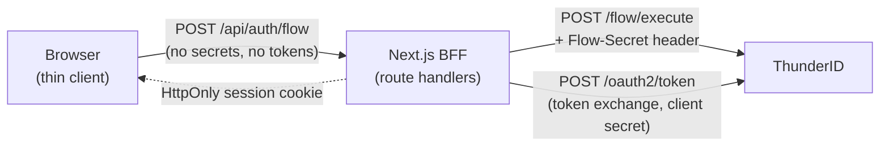

# Wayfinder Native Sample

App-native authentication for ThunderID, driven by a **Next.js Backend-for-Frontend (BFF)**.

This sample signs users in **without any redirect to a hosted login page**. The app renders its own sign-in,
registration, and password-recovery screens, while ThunderID enforces the flow logic server-side through the
[Flow Execution API](https://thunderid.dev/docs/next/guides/key-concepts/authentication/integration-models). It reuses
the Wayfinder travel use case and is the app-native sibling of the redirect-based `wayfinder-sample`.

## Why a BFF?

Initiating a native `AUTHENTICATION` flow requires holding a **Flow Secret**, a confidential-client credential. A
browser single-page app is a public client and cannot safely hold a secret, so ThunderID does not allow an SPA to start
a native sign-in directly. The fix is a Backend-for-Frontend: a small server that owns the secrets and drives the flow
on the browser's behalf.



The browser only ever exchanges non-secret step data (form inputs and the flow's `executionId`) with the BFF. The
**Flow Secret**, the **client secret**, and all **tokens** stay on the server. Tokens live in an encrypted, HttpOnly
session cookie the browser cannot read.

### How it works

1. **Start** the BFF calls `POST /flow/execute` with `{ applicationId, flowType }` and the `Flow-Secret` header.
   ThunderID returns the first step (`inputs` + `actions`).
2. **Drive** the browser renders each step; the BFF relays the user's input back via `POST /flow/execute` with the
   `executionId` and `challengeToken` until the flow completes.
3. **Complete** ThunderID returns a JWT **assertion**. The BFF exchanges it for OAuth tokens using the RFC 8693
   token-exchange grant (`POST /oauth2/token`) with confidential client authentication, then stores them in the session.

Because the flow is defined in ThunderID, changing it (for example, adding MFA) takes effect immediately with no change
to this app: the generic step renderer draws whatever inputs the server returns.

## Project structure

```
wayfinder-native-sample/
├── src/
│   ├── lib/
│   │   ├── config.ts        Server-only env config
│   │   ├── thunderid.ts     Flow client: Flow-Secret + token exchange (the BFF core)
│   │   ├── session.ts       iron-session (encrypted HttpOnly cookie)
│   │   └── mock-data.ts     In-memory flights and per-user bookings
│   ├── app/
│   │   ├── api/auth/flow    Proxy that drives the native flow and mints the session
│   │   ├── api/auth/session Returns the sanitized signed-in user
│   │   ├── api/auth/logout  Clears the session
│   │   ├── api/bookings     Protected mock bookings (requires session)
│   │   ├── api/me           Proxies /users/me with the session access token
│   │   ├── signin | signup | recovery   Native flow screens
│   │   ├── bookings | profile           Protected pages
│   │   └── page.tsx         Flight search landing
│   └── components/          Header, FlowRunner (generic step renderer), etc.
└── thunderid-config/        Importable ThunderID setup
```

## Prerequisites

- Node.js 20+
- A running ThunderID backend on `https://localhost:8090` (self-signed cert is fine).
- For password recovery only: any local SMTP inbox to receive the recovery email (for example
  [MailHog](https://github.com/mailhog/MailHog), or the `smtp-server/` bundled with the `wayfinder-sample`).

> Unlike the SPA samples, this app needs **no CORS configuration** on ThunderID, because the browser never calls
> ThunderID directly. Only the BFF does.

## ThunderID setup

Import `thunderid-config/thunderid-config.yaml` with `thunderid-config/thunderid.env`:

1. Start ThunderID and open the Console.
2. On the welcome screen, choose **Open**, upload `thunderid-config/thunderid-config.yaml`, then upload
   `thunderid-config/thunderid.env` for the environment variables.

The import creates:

| Resource | Type | Notes |
|---|---|---|
| `Customer` | User type | Self-registration enabled (`username`, `password`, `email`, `given_name`, `family_name`) |
| `wayfinder-native-booking` | Resource server | `booking:read`, `booking:create`, `booking:cancel` |
| `WAYFINDER-NATIVE` | Application | **Confidential Flow-Secret client.** `publicClient: false`, grant `token-exchange` only (no `authorization_code`), `client_secret_basic`. Carries a `flowSecret`. |
| `wayfinder-native-registration-flow` | Flow | Self sign-up with automatic sign-in on completion |
| `wayfinder-native-recovery-flow` | Flow | Email-link password recovery (links back to `http://localhost:3000/recovery`) |
| `Traveler` | Role | Booking permissions, assigned to `john.doe` and `jane.smith` |
| `john.doe` / `jane.smith` | Users | Demo customers |

Sign-in uses ThunderID's default username/password authentication flow.

### SMTP for recovery

Configure ThunderID's `deployment.yaml` to point at your local inbox and restart, for example:

```yaml
email:
  smtp:
    host: "127.0.0.1"
    port: 1025
    from_address: "noreply@thunderid.dev"
    enable_start_tls: false
    enable_authentication: false
```

## Configure the sample

```bash
cp .env.example .env
```

Set `SESSION_PASSWORD` to a random string of at least 32 characters (`openssl rand -base64 32`). The
`THUNDERID_CLIENT_SECRET` and `THUNDERID_FLOW_SECRET` defaults already match `thunderid-config/thunderid.env`.

## Run

```bash
npm install
npm run dev
```

Open `http://localhost:3000`.

## Try it

- **Sign in** click **Sign in**, enter `john.doe` / `john.doe`. Sign-in happens in-app, no redirect.
- **Register** click **Create one** on the sign-in page and fill in the form. Registration completes with automatic
  sign-in.
- **Recovery** click **Forgot your password?**, enter a username, open the recovery email from your inbox, and set a new
  password.
- **Book** search a route on the home page and click **Book** (prompts sign-in if needed). See it under **My Bookings**.
- **Profile** open **Profile** from the account menu. The BFF calls ThunderID's `/users/me` with the session access
  token and shows your account details.

## Verify the security model

Open your browser DevTools and confirm:

- The `wf_native_session` cookie is **HttpOnly** (not readable from JavaScript).
- No `access_token`, `id_token`, `refresh_token`, Flow Secret, or client secret appears in any network response the
  browser receives, or in any readable cookie or storage.
- The browser makes **no** direct requests to `https://localhost:8090`; every ThunderID call comes from the BFF.
